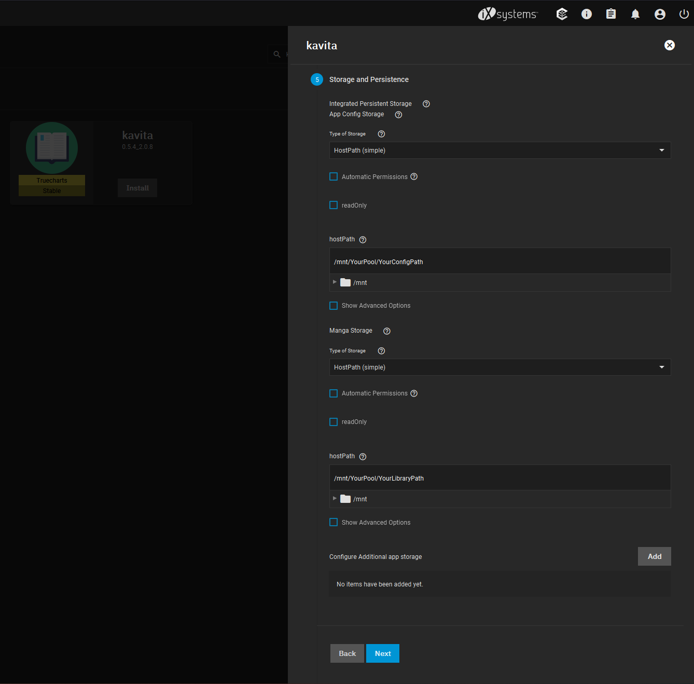

### Before you start
In your server's filesystem, create a folder for your library and a folder for Kavita's config.

### Installing Kavita (Stable)

[Install](https://truecharts.org/manual/Quick-Start%20Guides/02-Installing-an-App/#requirements=) the TrueCharts app catalog, search for Kavita, and click "install".

Modify the following sections:
- Application Name
  - Set the application name to whatever you want.
- Storage and Persistence
  - Set the storage type for "App Config Storage" to "HostPath (Simple)" and set the path to your config folder.
  - Set the storage type for "Manga Storage" to "HostPath (Simple)", and set the path to your library folder. This will mount to `/manga` within Kavita.

Leave all other sections at their default settings. Continue to the end and click "Save". 

To access Kavita, go to the Installed Applications page and click Kavita's "Open" button.

### Installing Kavita (Nightly)

As there currently isn't a TrueCharts app for Kavita's nightly releases, it needs to be installed as a Docker image.

Go to the Available Applications page and click "Launch Docker Image".

Modify the following sections:
- Application Name
  - Set the application name to whatever you want.
- Container Images
  - Set the image repository to `kizaing/kavita`.
  - Set the image tag to `nightly`.
- Port Forwarding
  - Click "Add" to add a port forwarding configuration.
  - Set the container port to `5000`.
  - Set the host port to any number between `9000` and `65535`. This port will be used to access Kavita.
- Storage
  - Click the "Add" button next to "Configure Host Path Volumes" twice.
  - For the first configuration, set the host path to your config, and set the mount path to `/kavita/config`.
  - For the second configuration, set the host path to your library, and set the mount path to `/manga`.

Leave all other sections at their default settings. Continue to the end and click "Save".

To access Kavita, browse to `your_server_ip:host_port`
