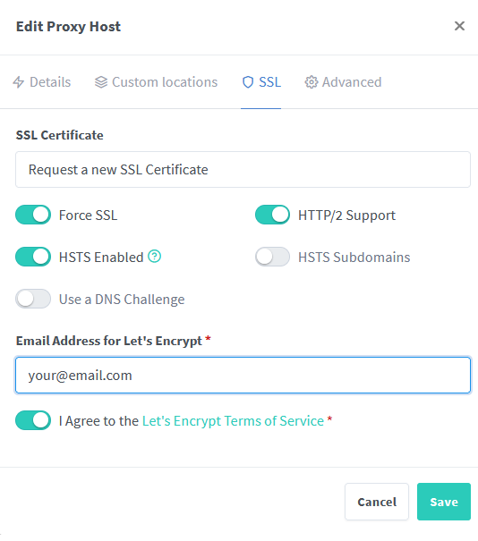

### NGINX Reverse Proxy Config

```
server{    
    set $server "Your_Kavita_IP_Here";
    set $port "Your_Kavita_Port_Here";
    set $domain "kavita.example.com";
    #set $organizr "organizr.example.com"; #Uncomment this for organizr support
    server_name $domain;
    
    location / {
         # The following configurations must be configured when proxying to Kavita

         # Host and X headers
         proxy_set_header        Host $host;
         proxy_set_header        X-Real-IP $remote_addr;
         proxy_set_header        X-Forwarded-For $proxy_add_x_forwarded_for; aio threads;
         proxy_set_header        X-Forwarded-Proto $scheme;

         # Headers to proxy websocket connections
         proxy_http_version 1.1;
         proxy_set_header Upgrade $http_upgrade;
         proxy_set_header Connection "Upgrade"; 

         # Proxy to Kavita running locally on port 5000 using ssl
         proxy_pass https://$server:$port;
         
         # Organizr support - uncomment both of the following lines
         #proxy_hide_header "Content-Security-Policy";
         #add_header Content-Security-Policy "frame-ancestors $organizr;"; 
    }
     
    

    listen 443 ssl; # managed by Certbot
    include /etc/letsencrypt/options-ssl-nginx.conf; # managed by Certbot
    ssl_dhparam /etc/letsencrypt/ssl-dhparams.pem; # managed by Certbot


    ssl_certificate /etc/letsencrypt/live/kavita.example.com/fullchain.pem; # managed by Certbot
    ssl_certificate_key /etc/letsencrypt/live/kavita.example.com/privkey.pem; # managed by Certbot

}

server {
    if ($host = $domain) {
        return 301 https://$host$request_uri;
     } # managed by Certbot

       listen 80;
       listen [::]:80;

       server_name $domain;
    return 404; # managed by Certbot
  
 }
 ```
 
 ### NGINX Proxy Manager with Let's Encrypt

* Head over to your Nginx Proxy Manager page 
* Add a new Proxy Host

* Set the following:
  * Domain Name: to the subdomain you want to use for Kavita
  * Scheme: http
  * Forward hostname/IP: your kavita IP 
  * Forward Port: Your kavita port
  * Cache Assets: Optional
  * Websockets Support: enabled
  * Block Common Exploits: enabled
* Click Save, then edit the proxy host you just created
* Head over to SSL, and choose "Request a new SSL Certificate"

* Set the following:
  * Force SSL: enabled
  * HSTS: enabled
* Click Save

### Adding Organizr iframe support in NGINX Proxy Manager:

* Edit your Kavita proxy host
* Click on "Custom locations" and add a locations
* Click the Gear icon on the right side of the location box to open the Advanced menu
* Set the following:
  * location: /
  * Scheme: http
  * Hostname: your Kavita IP
  * Port: Your Kavita Port
  * Advanced field: 
  proxy_hide_header "Content-Security-Policy";
  add_header Content-Security-Policy "frame-ancestors organizr.example.com;"; 
