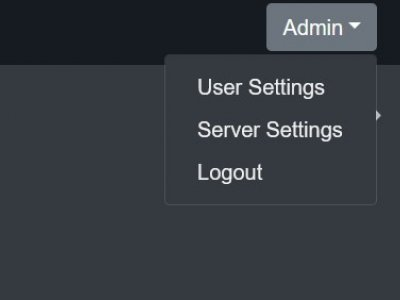
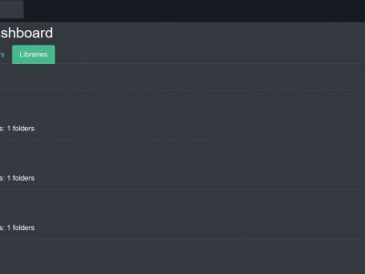
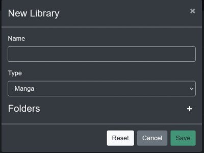

#### Page overview
[General info](#general-info) 
[Adding a library](#adding-a-library-to-kavita) 
[//]: # (TO BE ADDED: Creating first admin account )

 

### General Info
Kavita supports mixed media libraries. For example, your Light Novels (epub) and your Manga (cbz,cbr) can coexist in the same library. A library now is more just a grouping of media. Icons will show next to the series or book name to help you understand that, for example, one is a book and one is a PDF file.

 

### Setting up your Admin Account
To get started with Kavita, you must have an admin account created. There can be multiple admin accounts per server, but at least one must exist to manage the server. If you already have an account, a migration will prompt you at login to add an email. Email links can always be found in your logs in case the email is delayed or your server is not accessible. 

 

### Adding a Library to Kavita

To create a new Library, an Admin can select the Server Settings option from the Drop Down menu.

Then select the Libraries Tab.

Click the Add Library button. And give the Library a name.

Once named click on the Type Drop Down menu to select the type of media in this Library. Different media types use different ways to identify grouping. Use the one most applicable to your content.

Next, click the plus icon to begin the folder selection process. 
Each folder has a Share button which can be used to select all content in all sub-folders. Clicking on the folder names allows you to drill down further to share the exact folder you want.

! **Note**: It is not recommended to select a series folder directly because if it is empty then the scanning process will abort.

! **Note**: The folder selection process is the same on any install but will depend heavily on your configuration.

>>> **Important Docker users**: When creating a library, **do not select the first `manga`, `comics` or `epub` you see**. 
Instead, navigate to `/` and then you can select `manga`, `comics` or `epub`. Doing otherwise will result in your library being empty

If a Docker install is used the bind mount for the shared Content will be in this list under that name. e.g. `-v /your/manga/directory:/manga` In this example /manga will be visible in the Folder selection process and will lead to your shared content.

### Adding users to Kavita

To add new users to Kavita, navigate to the User Tab and click Invite. The invite user prompt will open, here you will fill out their email, the role you want to give them, and the libraries they should have access to. You can edit this anytime after they set up an account on your server. In the case your server is not accessible, for example, you're on localhost, Kavita will give you a link to send to your friend (or use yourself to set up their account). This link can always be found within your logs in case you misplace it. 

You should see this if your server is not accessible and hence sending a link to a user wouldn't work.

