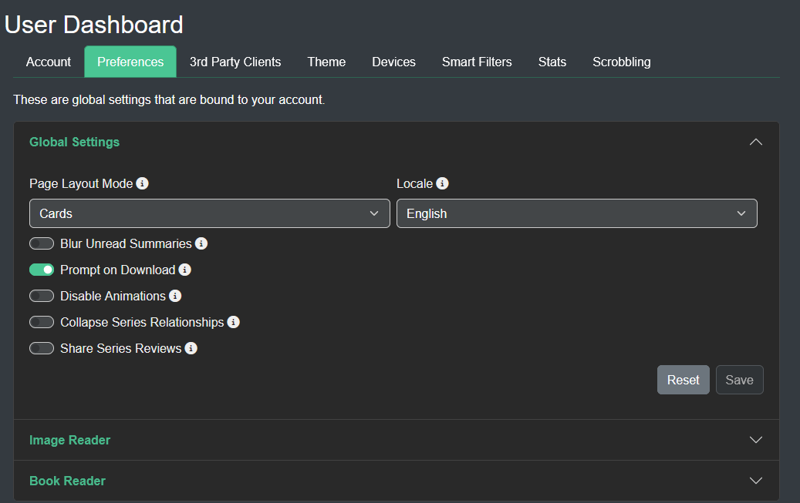

#### Page overview

- [Admin Dashboard](#admin-dashboard)
  - [General Tab](#general-tab)
  - [Users Tab](#users-tab)
  - [Libraries Tab](#libraries-tab)
  - [Media Tab](#media-tab)
  - Email Tab
  - [Taks Tab](#tasks)
  - [System Tab](#system-tab)
- [User Settings](#user-settings)
  - [Preferences Tab](#preferences)
  - [Password Tab](#password)
  - [3rd Pary Clients Tab](#3rd-party-clients)
  - [Themes Tab](#themes)

 

## Admin Dashboard
### General Tab 

#### Port and Logging level 
There are a multitude of settings that can be changed. The Port and Logging Level require a manual restart of the server to take effect.

#### Days of Backup
The number of backups to maintain. Default is 30, minimum is 1, maximum is 30.
#### Cache directory

The cache directory is where temporary files will be placed, for example, when a user reads a file, the file is usually cached or the output of processing is placed in this directory. Kavita will clear this out regularly.

#### Stats Collection

By default, Kavita will collect stats on your installation.

You can opt out at any time by turning off "Send Data" from the Admin Dashboard. 

All data is anonymized and contains **no information about your filenames or IP**.

The Kavita team actively uses this data to help design the UX and plan enhancements. If you chose to remain opted-in, thank you. It really helps in the design and planning effort. You can see exactly what data we collect [here](https://github.com/Kareadita/KavitaStats/blob/main/KavitaStats/Entities/StatRecord.cs).

#### Enable Swagger UI

This is a development setting. Only enable if you need to access kavita api documentation. 

Enabling it requires a restart.

You can now access swagger page on `http://<your kavita ip>:5000/swagger`

#### Enable OPDS support

You can enable OPDS for your Server here. See this [page](https://wiki.kavitareader.com/en/guides/settings/opds) for how it works.

 

 

### Users Tab
From the Users Tab, admins can see the pending invites to their server and their active users. 

They can quickly see information around them and modify their password, delete the user, or edit their library access or roles.

An admin cannot use this screen to modify their own roles (admin role will always have all applicable permissions) or library access (admin always has full access).

An admin can use the user settings page to change their password.

 

### Libraries Tab
Adding and Editing Libraries is covered [here](https://wiki.kavitareader.com/en/guides/first-time-setup#adding-a-library-to-kavita).

 

### Media
From the Media Tab, admins can set server-wide settings for media. As of v0.5.6, the only setting is Using WebP for Bookmarks. WebP offers impressive compression and performance with the only draw back of limited support on older iOS devices.

!!! Note: Turning this setting on/off will not do a conversion. When turned on, use [Tasks](#tasks-tab) tab to run the conversion job for all existing Bookmarks.

 

### Email

 

### Tasks
In this page you can, download logs, backup the database, check for updates, and manually Clear Cache. 

You can also specify when you want the library to scan itself and make backups.
 >>>System Cache is cleared automatically after a Library Scan and as a system function each night.

!!! Note: Manually clearing system cache while other users are reading on Kavita will incur a one-time loading during the reading experience.

#### Remove want to read
Kavita will remove any series from a user's want to read list, where the series has the Publication Status Completed (this implies everything is within kavita and no more issues will be released) and the user has fully read the series.

#### Checking For Updates
Kavita offers a quick way to see if a new version is available. From the Tasks tab, click Check for Update. A modal will appear if an update is available where you can read the new features and fixes and click Download to open Github and download the updated version. If you are on Docker, there is no Download button. Please pull the latest image yourself. 

 

### System Tab
Under the System Tab, admins can track what version Kavita is running

Under the More Info section are links to Kavita-related websites. [Donations](https://opencollective.com/kavita) are very appreciated and directly support development and web hosting. If you need to report an issue please visit the [GitHub](https://github.com/Kareadita/Kavita/issues) page. If Kavita is missing a function please visit the [Feature Request](https://feats.kavitareader.com/) link and make a new request, or vote on one you support.  

 

## User Settings
To access the user settings page, which holds the all settings for the logged-in user, you can use the nav bar dropdown on your username and select "User Settings". These settings apply to the logged-in user and will not affect any other user.

### Preferences
In this section, the user can configure site-wide preferences like default how the chapters/volumes are displayed (cards/list) or to blur the summaries descriptions.

#### Reading Settings
In the reading section, you will find all the options for the manga reader and the book reader. You can customize these as you like and they will apply on any of your devices. You can read more about each reader's setting [here (manga)](https://wiki.kavitareader.com/guides/webreader) and [here (book)](https://wiki.kavitareader.com/guides/bookreader).

### Password
The logged-in user can change their password from this screen.

 

## 3rd Party clients
Kavita provides multiple ways to connect to your server from external applications. You can find them below:

[Generic (OPDS)](./opds)

[Tachiyomi](../06.misc/tachiyomi)

 

## Themes
As of v0.5.2 Kavita allows for custom themes. We have opened up some elements to change via CSS variables. Please read the Themes page below for further info:

[Themes](./themes)
