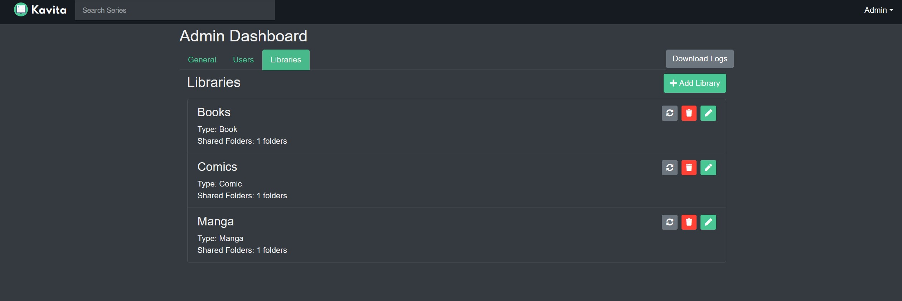
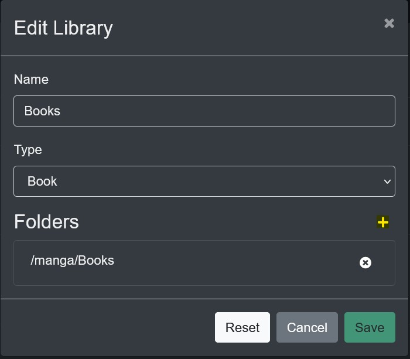

### Adding another Folder to an existing Library

Many different directories from several sources can be added to Kavita in order to add content to a Library. As long as the Type of content is the same, other directories can be added to a Library.
The "Shared Folders:" line on the Libraries Dashboard shows have many folders have been added.

To add another folder select the Pencil Edit Icon to the right, and click the plus sign. Below it you will see the folder/s already added to this Library.

Each folder has a Share button which can be used to select all content in all sub-folders. However, Clicking on the folder names allows you to drill down further to Share the exact folder you want.
