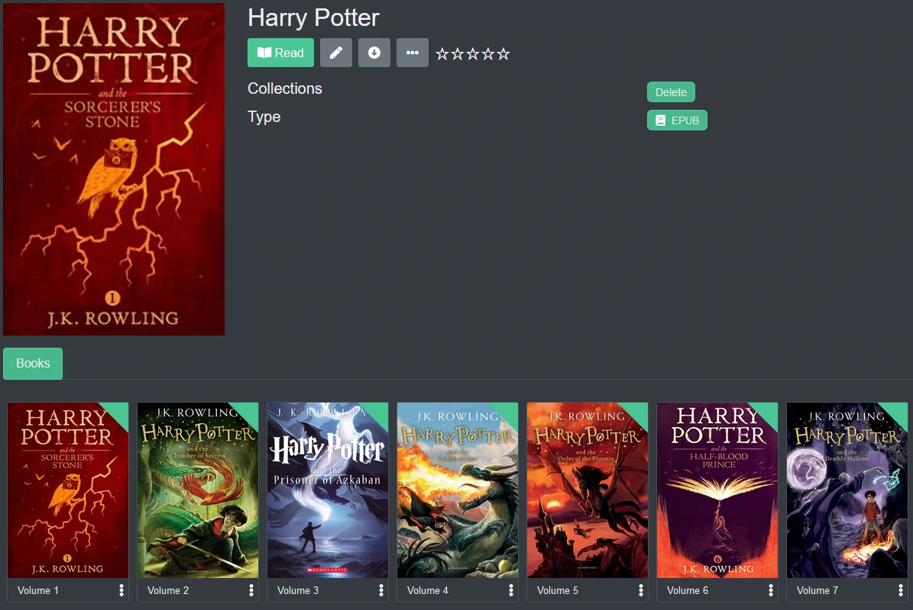

### EPUB Structure

EPUB are primarily parsed by metadata within the epub file (opf). Filenames are used only for Volume and Series, but metadata overrides everything. eBooks do not fall back to folders for parsing.

Kavita scans epubs in a 2 pass process. The first pass pulls from the internal metadata. If the Series is missing, the epub will use the title and if title missing, then will fallback to the filename parser. The second pass will use filename to fill in the missing information to be included in Kavita. If **volume** and **series** name can be parsed, then the book is treated like a manga or comic and will how Volume X in the Series detail for the individual books. Within the metadata, certain tags are used to group them into a series, like "Expanse".
Calibre eBook Management software can be used to edit epub metadata to include Series, Volume, and Title so that series with multiple books parse correctly into the same series. [Calibre](https://wiki.kavitareader.com/en/guides/misc/calibre)

Any EPUB can use:
```  
If the following tags exist in an epub:
calibre:series_index
calibre:series
calibre:title_sort 

Then map out the book as:

Series = calibre:series
Volume = calibre:series_index
Title = calibre:title_sort

An example of this would be:
Stephen King - Dark Tower 01 - The Gunslinger
Stephen King - Dark Tower 02 - The Drawing Of The Three

These belong to a series. In each epub, you'll see:
calibre:series = Dark Tower
calibre:title_sort = The Gunslinger, The Drawing Of The Three (respectively)
calibre:series_index = 1, 2 (respectively)
```
As of version 0.4.2, Kavita now supports EPUB version 3.2 "belongs-to-collection" tag as well.
```
<metadata>
    …
    <meta property="belongs-to-collection" id="c01">
        The Lord of the Rings
    </meta>
    <meta refines="#c01" property="collection-type">set</meta>
    <meta refines="#c01" property="group-position">2</meta>
    …
</metadata>
```

Here you can see the Harry Potter series, as coded above. Each book is an individual series, but because of the collection metadata, they are ordered and grouped together as "Harry Potter"

