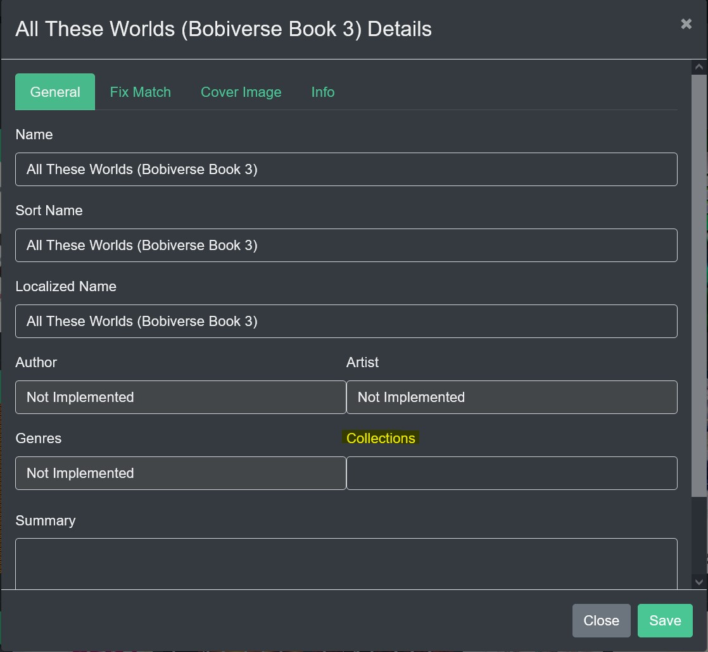
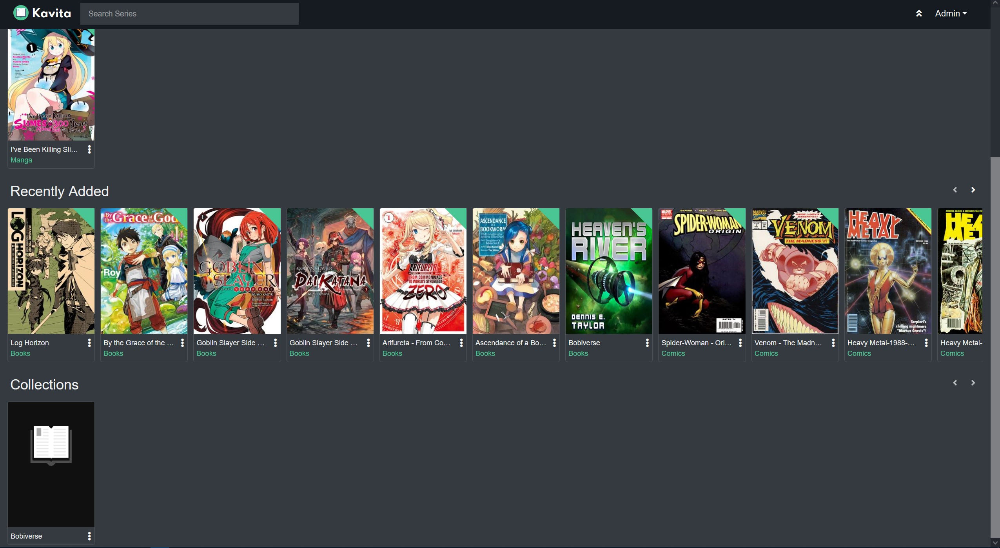
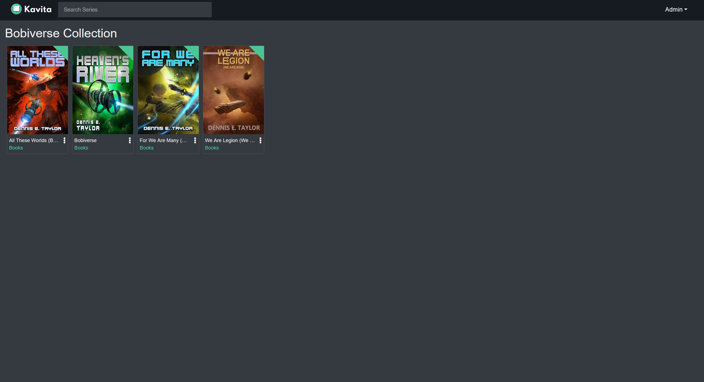
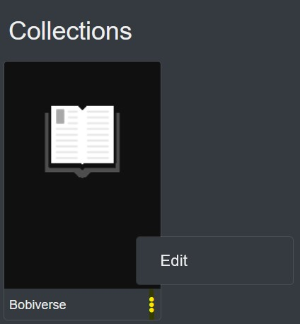
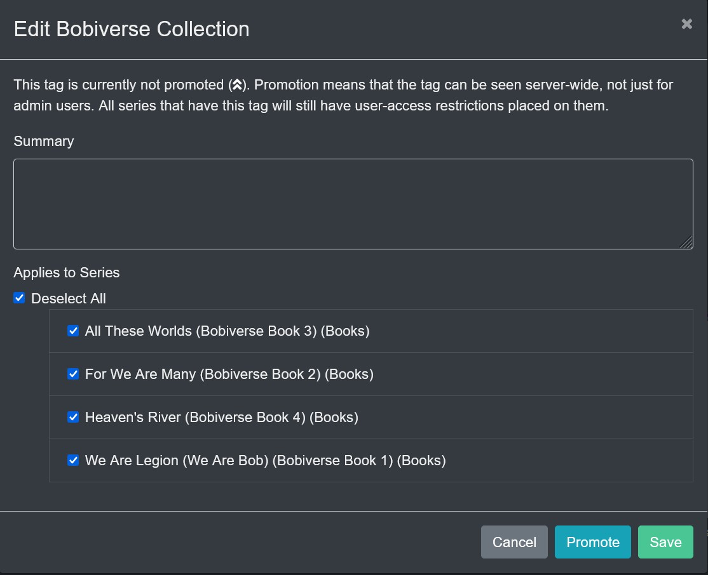

### Collections

By selecting the Edit option in the Action Menu a Collections tag can be created and will be used to create a collection with that name. Other Books/Comics/Manga can have this Tag added to become part of the Collection which will be shown on the Kavita Homepage.

Collections will appear at the bottom of the Kavita homepage. (Collections do not support cover art at this time.)

When selected all items in the Collection will be available.

To "Promote" a Collection to other Kavita users' homepage, select the Action Button on the Collection and select Edit. And then the Promote button.

! **Note**: Although a Promoted Collection can be seen by others, they may not have access to the items due to user access restrictions on what Libraries they can see.