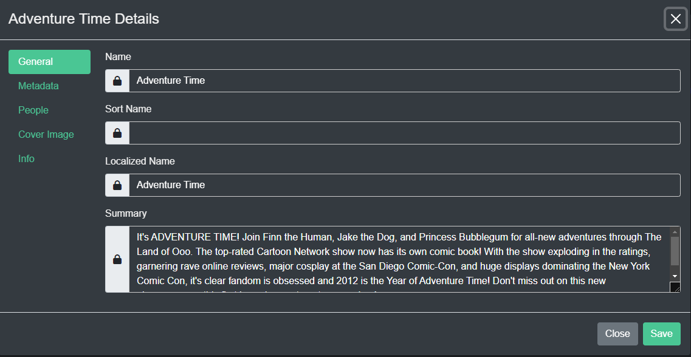
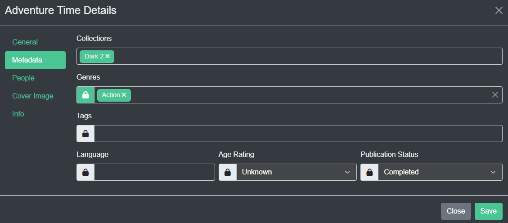
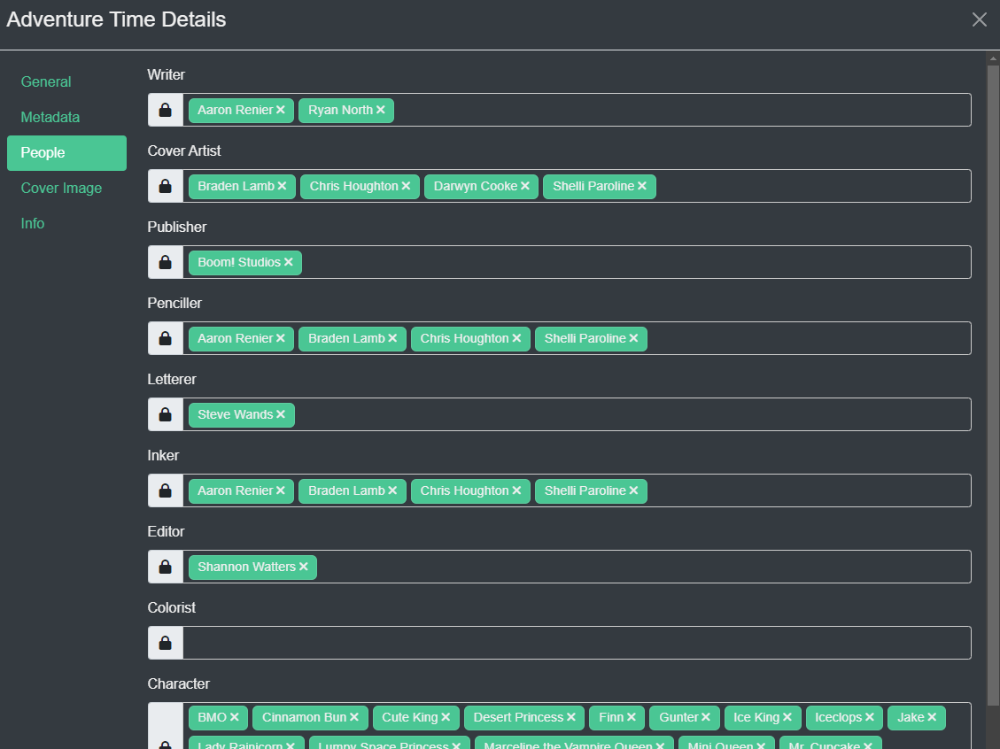

### Metadata
Kavita supports reading metadata from ComicInfo and epub files, but sometimes these mediums are limited or tedious to update. In this case, you can use the built-in metadata editing functionalities of Kavita. Metadata editing within Kavita is not aimed at media management. Use external tools for that.

! Kavita does not save to the underlying file. Use external tools to update ComicInfo.xml or OPF files. 

### Locking Fields
When you edit a field, the field will show a locked icon next to it. This implies that if you add ComicInfo or change ComicInfo, it will not reflect within Kavita, as the field is locked. You can always unlock a field by clicking the lock. In addition, you can edit the item, like Name, and click unlock in the same go, which will allow a ComicInfo update to change it.

### Metadata

