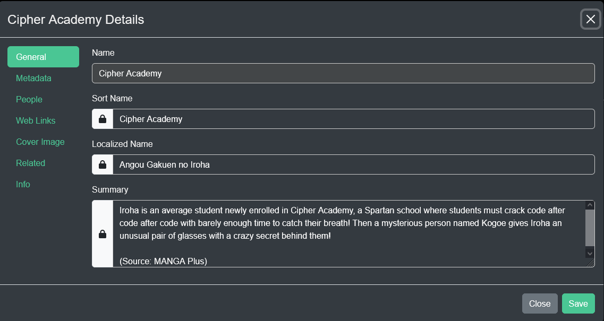
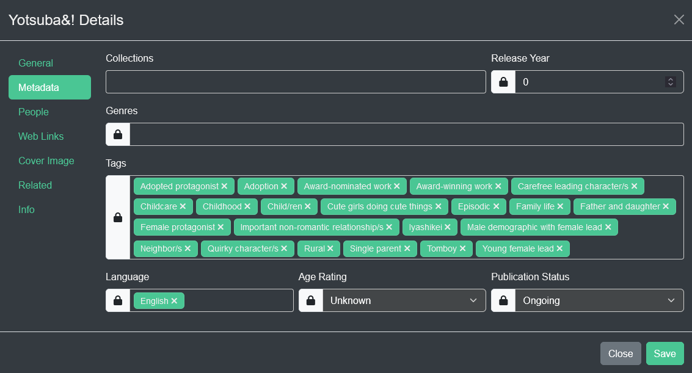
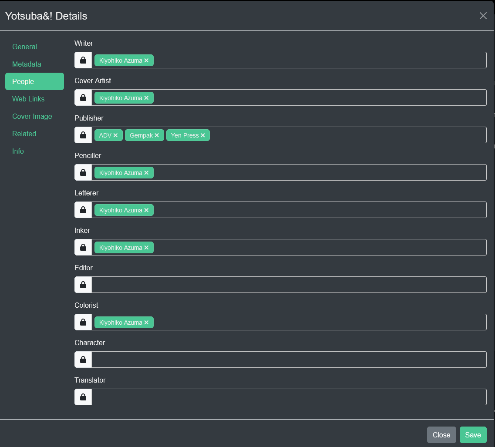
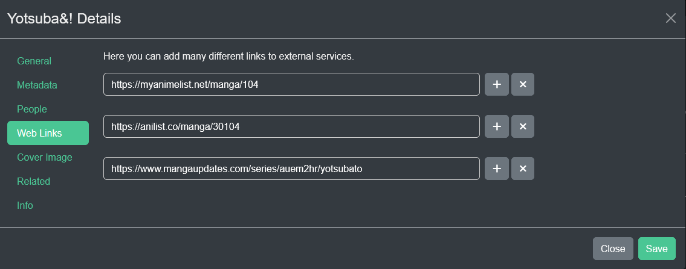

### Metadata
Kavita supports reading metadata from ComicInfo and epub files, but sometimes these mediums are limited or tedious to update. In this case, you can edit the metadata directly inside Kavita. This will only modify the entries in Kavita's database. Changes made here will NOT be written to the files on disk. Metadata editing within Kavita is not aimed at media management. Use external tools for that.

! Kavita does not save to the underlying file. Use external tools to update ComicInfo.xml or OPF files. 

As of version 0.7.4 the `Name` field is no longer editable. It is used to directly map to file metadata or filename parsed.

### Locking Fields
When you edit a field, the field will show a locked icon next to it. This implies that if you add ComicInfo or change ComicInfo, it will not reflect within Kavita, as the field is locked. You can always unlock a field by clicking the lock. In addition, you can edit the item, like Name, and click unlock in the same go, which will allow a ComicInfo update to change it.

### Metadata

