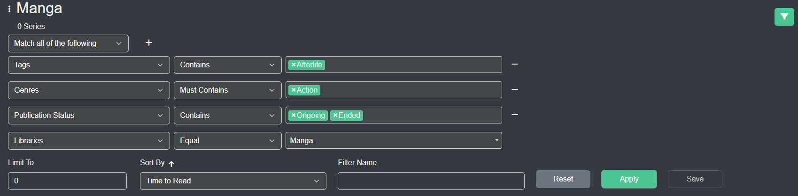
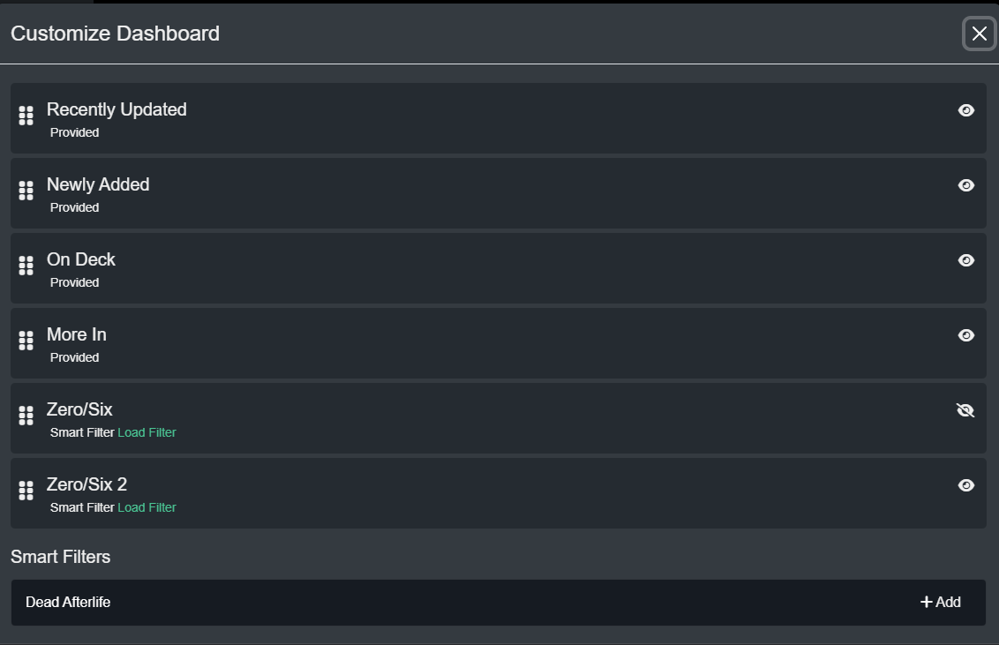

! This is a WIP for the new metadata filtering screen and Dashboard/Side Nav Customization

## Metadata Filtering
Kavita (v0.7.8+) has a rich metadata interface which allows you to build complex filters to find exactly what you're looking for. The system allows for you to build a series of statements that AND or OR together with custom sorting and a limit feature (for those that have large libraries). 

Starting in v0.7.9, users can save these filter schemes as a Smart Filter. By placing a name in the filter and pressing Save, a smart filter is created/updated. These are the basis of customization for the Dashboard and Side Nav. 

## Customize Your Dashboard
In order to customize your dashboard, click the actionable menu from the Home side nav and click Customize. From here you will see a list of Dashboard Streams (a stream is a flow of items within Kavita). Kavita comes out of the box with some custom coded streams, like On Deck or Recently Updated Series. However, not all users like the logic Kavita uses and may want their own. This is where Smart Filters and Dashboard customization plays a place. In this screen you can:
- Reorder Streams
- Disable Streams
- Add Existing Smart Filters to the Dashboard 

! Note: Smart Filter based streams will run the smart filter query, so you can edit the smart filter at any given time (via User Settings -> Smart Filter or Clicking on the stream title)

