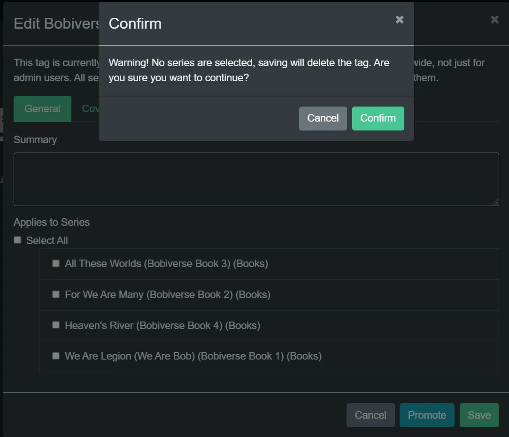

### Collections

To create a collection, select the Edit option in the Context Action Menu , a collections tag can be created and will be used to create a collection with that name. Other books, comics and manga can have this tag added to become part of the collection.

Collections can be accessed from the list of libraries, or from a series that is part of a collection.

When selected, all series in the collection will be available.

To edit a collection, click on the Context Action button and select Edit.

To "Promote" a collection to other Kavita users' homepages, click on the Promote button.

! **Note**: Although a promoted collection can be seen by others, they may not have access to the items due to user access restrictions on what Libraries they can see.
To edit the cover image for a collection, select the Cover Image tab and choose a method to select a new cover. The Cover can also be Reset to default on this Tab.

To Delete a Collection/Tag uncheck all Series in the Collection and hit Save. A popup will warn that you are about to delete the Collection/Tag.
