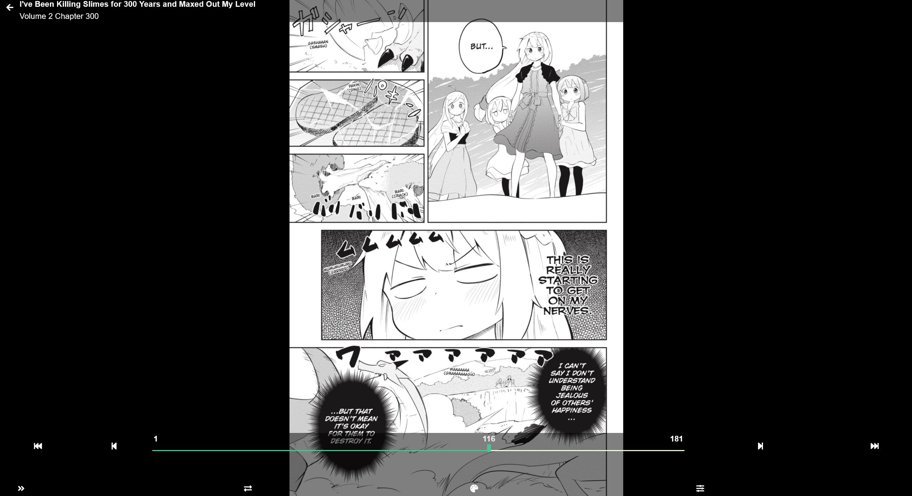

### Manga Reading Progress

When reading your progress is saved automatically so that you can resume at any time or from a different device.

In this example we can quickly see that Volume 1 has been opened as there is no Green flag in the top right corner, and while Volume 2 is also missing the flag it has a green progress bar below the cover art.

Volumes 3 though 6 have the Green Flag which can mean that the item is either newly added or untouched. If you open a Volume and close it again the Green Flag will disappear.

Inside the Manga with the Progress bar, clicking on the current image will bring up the on screen display which will also show your reading progress and allow you to change options or skip forwards or backwards.

