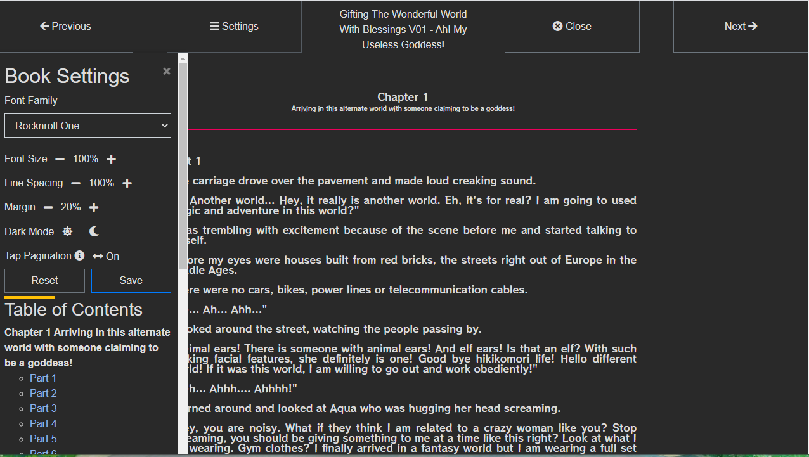
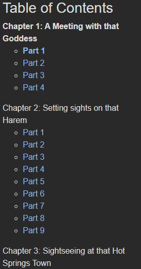

## Progress
The book reader will remember approximately where you leave off and will try to restore the scroll position. This will work regardless of what size device you start and resume on. 

## Menu Controls

Like many other readers, Kavita offers customizations for your reading experience. We offer 7 additional fonts to select from in addition to the font the comes with the book. Font sizing, line spacing and margin can all be customized (Margin will default to 0% on mobile devices regardless of your settings). 

We offer reading direction and tap to paginate. Tap to Paginate lets you click on the sides of the book rather than having to press the Next/Prev page buttons on the top or bottom of the reader. 

The book reader let's you save your settings to your account from within the reader. You are not required to press Save, you can instead adjust just for that reading session. 

## Table of Contents

Kavita provides a dedicated section in the menu drawer for the table of contents. If a table of contents is not provided in the book metadata, Kavita will attempt to create one by parsing out links and headers in the book itself. As you read, the links will become bold based on where in the page you are. For example, in the image here, I have scrolled down and am on the First part on the first Chapter. Notice that the Chapter is also bold. You can click on any link to jump instantly to it. 

## Inner Links
Some books have links within the reader. Some external and some internal. Kavita does pre-processing before you read and determines if a link is external or not. All external links will open in a new tab. Internal links can be clicked and Kavita will remember the history of links clicked, so you can back out of your nested linking in order by pressing the back button. 

## Continuous Reading
The book reader offers a way to stay within the reader and move on to the next book (assuming your book is in a series or a reading list). Like the web reader, we now have buttons to manually click and jump between books. Likewise, when you read the first or last page of the book and there is another book, the Next button will show two arrows implying the pagination will load the next book.

