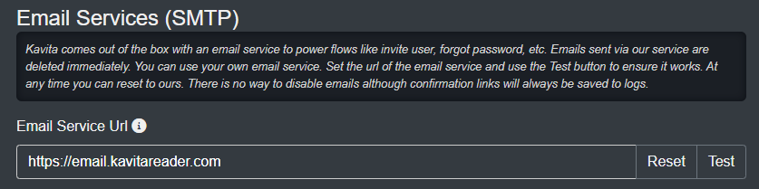

# Kavita Email
Kavita provides an email functionality out of the box to invite users, send reset password links, and more. We currently use a Google account which sends the emails and auto deletes them. However, not all users want to put trust in another party and for this, Kavita offers [KavitaEmail](https://github.com/Kareadita/KavitaEmail) microService, so you can use your own SMTP service.

To get started, head over to the KavitaEmail Github and download a release, or use our [docker container](https://hub.docker.com/r/kizaing/kavitaemail).

<hr style="border:5px solid #4ac694"> </hr>

# Installation

### With Docker Run

`docker run --name kavita-email -p 5003:5003 -e SMTP_HOST="" -e SMTP_PORT="" -e SMTP_USER="" -e SMTP_PASS="" -e SEND_ADDR="" -e DISP_NAME="" -d kizaing/kavitaemail:latest`

### With Docker Compose

```
version: '3'
services:
     email:
        image: kizaing/kavitaemail:latest
        container_name: kavita-email
        environment:
           - SMTP_HOST=<your smtp hostname here>
           - SMTP_PORT=<smtp port>
           - SMTP_USER=<smtp username>
           - SMTP_PASS=<smtp password>
           - SEND_ADDR=<address you are sending emails from>
           - DISP_NAME=<display name to use>
        ports:
           - "5003:5003"
        restart: unless-stopped
```

### Non-Docker
1. Open appsettings.json in config/
2. Under SMTP, fill out the required settings that are blank. Note: If you use Gmail, you need to enable Insecure Apps or generate a password key for the account.
3. Start KavitaEmail.exe or ./KavitaEmail


### Kavita Side
Once you have setup your KavitaEmail service, you can now link your Kavita instance with KavitaEmail service. Navigate to Server Settings and under Email, you can change the url to your local service (and port if needed). Press Test to ensure it works.



