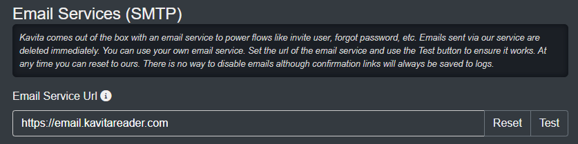

# Kavita Email
Kavita provides email functionality out of the box to invite users, send reset password links, and more. We currently use a Google account that sends the emails and then auto deletes them. However, not all users want to put trust in another party and for this, Kavita offers [KavitaEmail](https://github.com/Kareadita/KavitaEmail) microService, so you can use your own SMTP service.

To get started, head over to the KavitaEmail GitHub and download a release, or use our [Docker container](https://hub.docker.com/r/kizaing/kavitaemail).

<hr style="border:5px solid #4ac694"> </hr>

# Installation

!!! Note: If you use Gmail, you need to enable Insecure Apps or generate an app password.

### With Docker Run

`docker run --name kavita-email -p 5003:5003 -v ${PWD}/config:/app/config -d kizaing/kavitaemail:latest`

### With Docker Compose

>>>>>> To setup the mail service with docker it's highly recommended to use docker-compose. This allows both containers to be accessible to each other. Later in Kavita you would only need to type down `http://[email-container-name]:[yourport]` in the SMTP service settings.
<br/>To do so just copy the config from "email" to the bottom and either create a new docker compose file or add it to your current Kavita compose.


```
version: '3'
services:
     email:
        image: kizaing/kavitaemail:latest
        container_name: kavita-email
        volumes:
           - [Your-Kavita-Email-config-path]:/app/config
        ports:
           - "5003:5003"
        restart: unless-stopped
```
Example with both Kavita and Kavita-Email:
```
version: '3'
services:
     kavita:
        container_name: kavita
        image: kizaing/kavita:nightly
        ports:
           - 5000:5000
        volumes:
           - [Your-media-path]:/media
           - [Your-Kavita-config-path]:/kavita/config
        restart: unless-stopped

     kavita-email:
        container_name: kavita-email
        image: kizaing/kavitaemail:latest
        ports:
           - 5003:5003
        volumes:
           - [Your-Kavita-Email-config-path]:/app/config
        restart: unless-stopped
```

!! After the first run, shut down the container and edit the appsettings.json file inside the config folder. When the settings are to your liking, restart and it should apply your SMTP settings.

### Non-Docker
1. Open appsettings.json in config/
2. Under SMTP, fill out the required settings that are blank.
3. Start KavitaEmail.exe or ./KavitaEmail


### Kavita Side
Once you have set up your KavitaEmail service, you can now link your Kavita instance with KavitaEmail service. Navigate to Server Settings and under Email, you can change the URL to your local service (and port if needed). Press Test to ensure it works; as of Kavita-email v0.1.15.0 and Kavita v0.7.1.35 this will send an actual test email to the admin account's email address.



