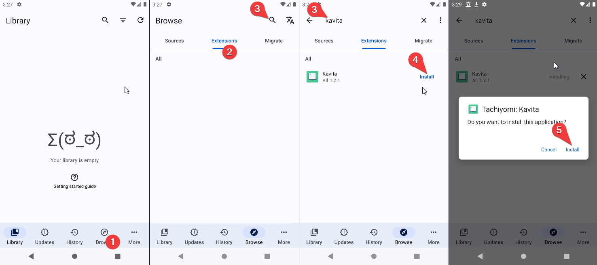
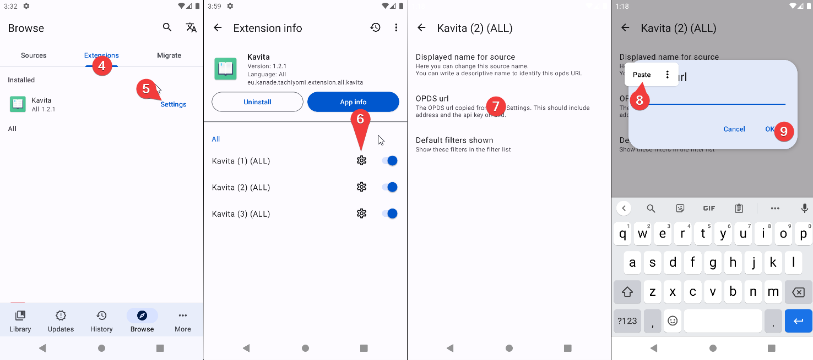

### Guide Overview
* [Issues](#issues)
* [Installation](#installation)
* [Setup](#setup)
* [Usage](#usage)
* [Customization Guide](#customization)
* [Sync Progress with Kavita](#sync-progress-with-kavita)
! Note: Currently there's only official support for the original Tachiyomi version. 
! Some of the forks that are confirmed (by the users) to work are: TachiyomiSY, TachiyomiAZ

## Issues
If you find any errors please report them [here](https://github.com/ThePromidius/tachiyomi-extensions/issues/new?assignees=&labels=Bug&template=report_issue.yml). 

That links to the plugin's GitHub. Please do not create issues on Kavita's GitHub for extension-related issues.
## Installation

**First of all make sure Kavita is updated**

1. After that, after opening Tachiyomi, go to Browse in the lower nav.
2. Select the Extensions tab at the top of the screen.
3. Now you can either scroll down until you find or hit the search icon and write Kavita in it.
4. Once you find or search tap install.
5. In the confirmation menu hit install again.

## Setup

To make the extension link with your Kavita instance we need the OPDS URL.
The steps to get the OPDS URL are:

Access your Kavita instance from your web browser and log in
1. Access your Kavita user dashboard
2. Switch to "3rd Party Clients" tab
3. Copy the text under the OPDS URL

**Once the  OPDS URL is obtained open Tachiyomi**
4. Go back to the Tachiyomi extensions tab
5. Tap Kavita
6. Tap the gear icon in one of the sources. (sources explained in customization)
7. Tap OPDS URL setting
8. Paste your OPDS URL (If your OPDS URL address differs from your Kavita address, change it.)
9. Tap ok
10. Restart Tachiyomi
11. Browse your library 

## Usage
### Browse all your libraries

### Browse recently added

## Customization
#### Change source name
##### First of all, what is a source? 
Once installed the user has access to 3 sources.  
This means you can have access to 3 different Kavita servers. 
On each source, you can set up different OPDS URLs and different filter preferences. 
By default, these are differentiated with a number. 1, 2 and 3. 
You can change each identifier with your own. 

##### To change the name of the source 
Follow the same process used for OPDS but tapping "Displayed name for source" instead.
#### Remove filters from filter list
The same process is used for OPDS but tapping "Default filters shown" instead.
This will hide or show filters appearing in the filter list. 
To hide one filter just uncheck the checkbox

## Sync Progress with Kavita
Kavita has progress sync with Tachiyomi. It will automatically mark completed volumes and chapters as read in both apps. It does not sync page progress, it only syncs when a volume (or chapter if they are split) is complete.

To activate tracking go to settings > Tracking and click on Kavita at the bottom.

After activating it will appear with the rest of the trackers on your manga page. Make sure it shows its active otherwise it will not sync.

