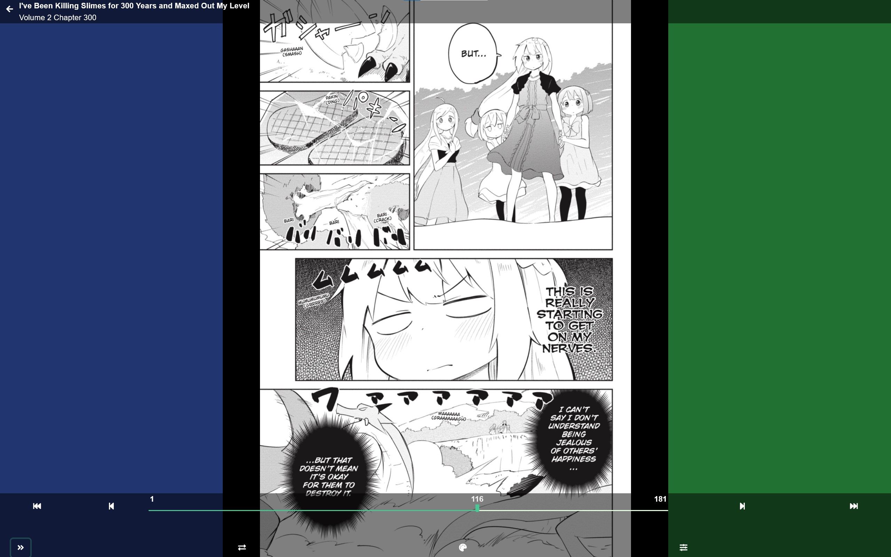

When in the WebReader click of tap in the center of the screen to bring up the Menu. In the top left the Arrow will let you exit the Manga/Comic and the Title, Volume, and Chapter of what you have open is displayed.

Previous Chapter or Volume

First Page

Last Page

Next Chapter or Volume

Reading Direction: Left to Right or Right To Left

When changing the Reading Direction option Colors will briefly highlight the Pagination (page turn) areas.

Reading Mode: is either Side to Side, Up and Down, or Webtoon mode

Color Options: None, Dark, or Sepia 

WebReader Settings

! Note: All Menu options scale with the screen size of your device display.

Image Splitting Options: Right to Left or Left to Right

Image Scaling Options: Height, Width, and Original

Auto Close the Menu Check Box

!! Warning: No settings changes are saved until exiting the menu.