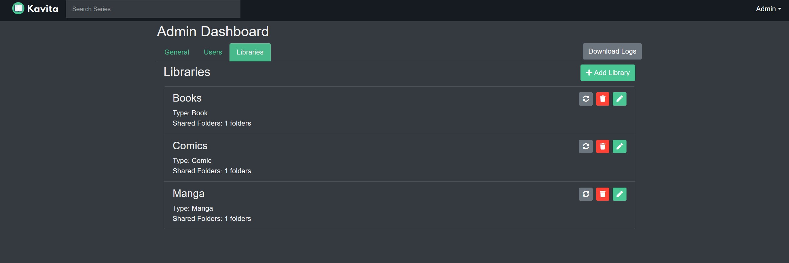
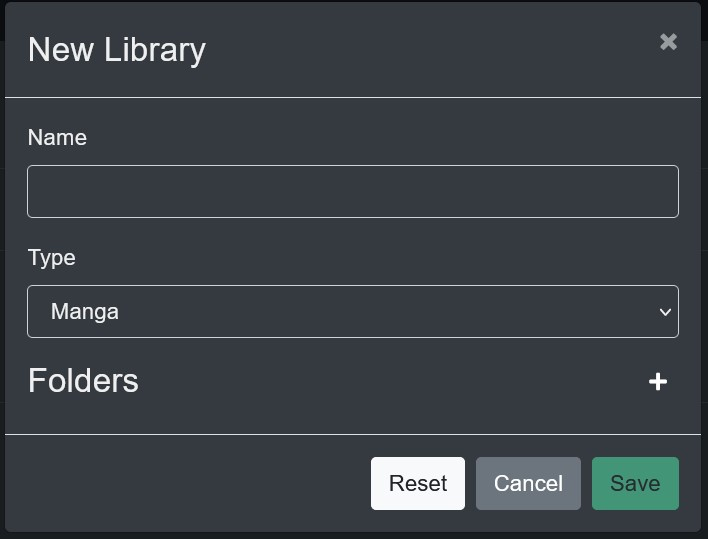
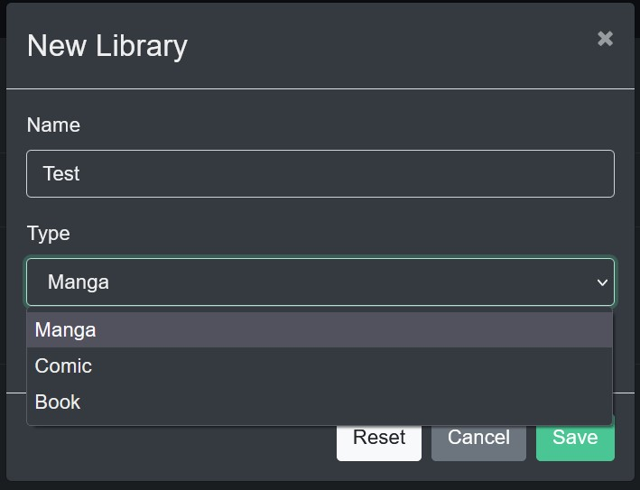

### Adding a Library to Kavita

To create a new Library an Admin can select the Server Settings option from the Drop Down menu.

Then select the Libraries Tab.

Click the Add Library button. And give the Library a name.

Once named click on the Type Drop Down menu to select the type of media in this Library.

Next click the Plus sign icon to begin the Folder selection process. Drill down to the top level you want and click Share.

