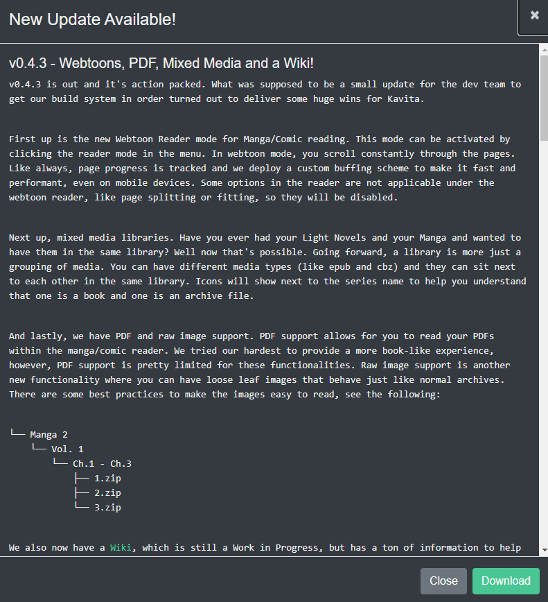
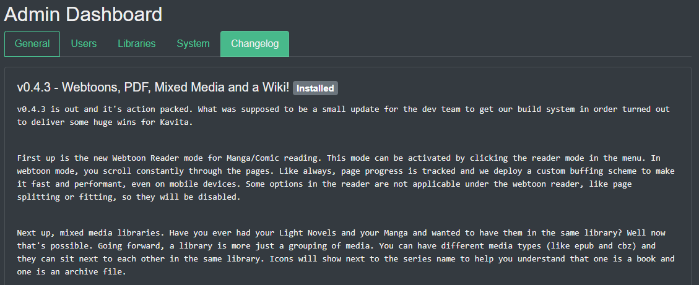
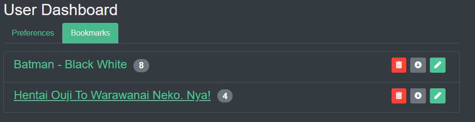

Kavita offers a few different settings for you as an owner and for users. 

# Server Settings
To access the admin dashboard, which holds the all settings for the server, you can use the nav bar dropdown on your username and select "Server Settings". This option is only available for admins.

### General Tab 
There are a multitude of settings that can be changed. The Port and Logging Level require a manual restart of the server to take effect. The cache directory is where temporary files will be placed, for example, when a user reads a file, the file is usually cached or the output of processing is placed in this directory. Kavita will clear this out regularly.

Allowing Anonymous Usage Collection is here, you can opt out. This setting allows you to send Anonymous data about your install which helps the Kavita team understand it's user base to make design decisions and performance enhancements. Some information that is collected is file types within kavita, number of users, screen sizes and browser information, OS, version, if you are using docker or not. The Stat collection is within the Kavita and KavitaStats repositories.

You can enable OPDS for your Server here. See this [page]() for how it works.

Reoccurring tasks are also configurable to be changed.
### Users Tab
Adding Users is covered [here](https://wiki.kavitareader.com/guides/user-management).

### Libraries Tab
Adding and Editing Libraries is covered [here](https://wiki.kavitareader.com/guides/adding-a-library).

### System Tab
Under the System Tab admins can track what version Kavita is running, download logs, backup the database, check for updates, and manually Clear Cache. 
System Cache is cleared automatically upon Library Scan or as an system function each night.

!!! Note: Manually clearing system cache while other users are enjoying Kavita will incur a one-time loading during the reading experience.

Under the More Info section are links to Kavita related websites. [Donations ](https://opencollective.com/kavita)are very appreciated and directly support development and web hosting. If you need to report an issue please visit the [github](https://github.com/Kareadita/Kavita/issues) page. If Kavita is missing a function please visit the [Featurehub](https://feathub.com/Kareadita/Kavita) link and make a new request, or vote on one you support.  

### Checking For Updates
Kavita offers a quick way to see if a new version is available. From the System tab, click Actions -> Check for Update. A modal will appear if an update is available where you can read the new features and fixes and click Download to open the Github and download the updated version. If you are are on Docker, there is no Download button. Please pull the latest image yourself. 

In addition, a new tab is available: Changelog. You guessed it, it is a log of all the versions and the changes that go along with it. You can also jump to the Github to view it on the site itself. 

# User Settings
To access the user settings page, which holds the all settings for the logged in user, you can use the nav bar dropdown on your username and select "User Settings". These settings apply for the logged in user and will not affect any other user.

### Site Settings
In this section, the user can configure site-wide settings. For now, there is only Dark Mode. Dark Mode is the default theme (v0.4.2+).

### Reading Settings
In the reading section, you will find all the options for the manga reader and the book reader. You can customize these as you like and they will apply on any of your devices. You can read more about each reader's setting [here (manga)](https://wiki.kavitareader.com/guides/webreader) and [here (book)](https://wiki.kavitareader.com/guides/bookreader).

### Password
The logged in user can change their password from this screen.

### Bookmarks
Bookmarks are pages that you want to download after reading for a given series. While using the web reader, you can bookmark certain pages using the bookmark button on the top right. This will save a reference to that page for the given series. From the bookmarks tab in User settings, you can see all Series you have bookmarks on and for each series, download or clear said bookmarks. 

