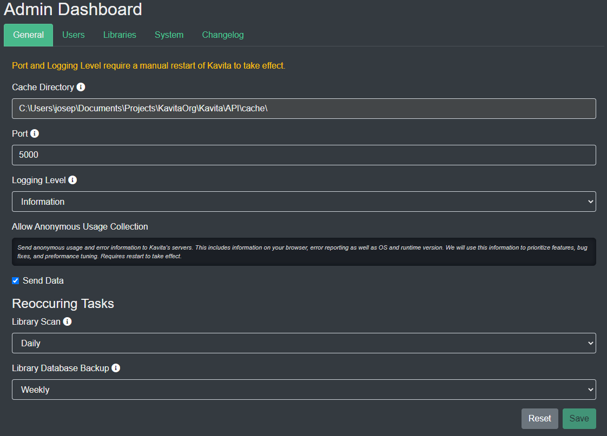

Kavita offers a few different settings for you as an owner and for users. 

# Server Settings
To access the admin dashboard, which holds the all settings for the server, you can use the nav bar dropdown on your username and select "Server Settings". This option is only available for admins.

# User Settings
To access the user settings page, which holds the all settings for the logged in user, you can use the nav bar dropdown on your username and select "User Settings". These settings apply for the logged in user and will not affect any other user.

### Site Settings
In this section, the user can configure site-wide settings. For now, there is only Dark Mode. Dark Mode is the default theme (v0.4.2+).

