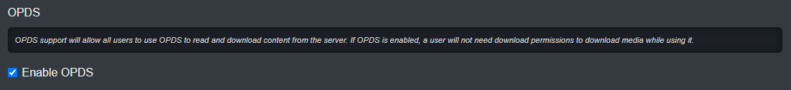

OPDS is an open standard for browsing and consuming content on your server from external readers. To enable OPDS for your server, under System Settings, enable OPDS.

This will grant all your users a unique URL and an API key (like a unique password) to access your server from these external readers. The url can be found under user settings.

From this UI, a user can use the copy button to quickly copy it into their clipboard. The red refresh button is used to generate a new API key and thus a new url.

Kavita supports OPDS-PS (page streaming) which will capture your progress when reading through external readers. Currently only Chunky Reader on iOS supports OPDS-PS. 