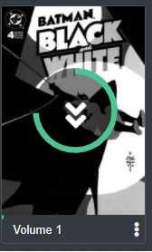

In Kavita, there are many different actions you can take on different entities. This page covers the different actions you can take.

### Downloading
If a user has the Download role, they can download files from Kavita. Because Kavita uses a grouping mechanic, the downloads will mimic this structure. From any Series, Volume, or Chapter, a user can kick off a download via the context menu. If the underlying file is just one individual file, it will be sent as is, otherwise, the files will be grouped in a zip and downloaded. 

Downloads may take longer than expected to process. Kavita will show a spinner on the item you are attempting to download from. 

### Bookmarks
Bookmarks are pages that you want to download after reading for a given series. While using the web reader, you can bookmark certain pages using the bookmark button on the top right. This will save a reference to that page for the given series. At any point in the future, you can use the Series detail context action to open the bookmarks modal for that series. This will give you the option to download all bookmarks in a zip file or delete all references to the bookmarks. You can also view all bookmarks for your account in your [User Settings](https://wiki.kavitareader.com/en/guides/preferences#bookmarks). 

### Info Modal
Kavita has grouping which sometimes can be confusing, did a file get grouped properly? How can I check? This is where the Info modal comes from. From a Volume/Chapter, use the context actions menu to select Info. From Series detail, you must be an admin and can use the Edit button.

#### Volume Info

The volume info has some extra functionality. First, as you can see, we have individual chapters that are grouped into one virtual volume. When reading, you can jump chapter to chapter, but what if you want to re-read chapter 2? This screen will let you by clicking the cover image, which will open the reader directly on that chapter. Likewise, what if you've already read chapters 1-4 and want to quickly mark them as read? Using the context action button next to the Chapter title, you can now: 
* Mark as Read
* Mark as Unread
* Download

From this screen, you can also update the cover image for the volume if you are an admin. See the [section below](https://wiki.kavitareader.com/en/guides/contextual-actions#overriding-cover-images) for more information.

### Series Info

## Overriding Cover Images
As mentioned in [Scanning and Refreshing Metadata](https://wiki.kavitareader.com/en/guides/scanning-analyzing-and-refreshing-metadata#what-happens-during-analysis), Kavita handles generating cover images based on a set of rules. However, if you want total control or want a different image without having to update the actual file, you can now do that with the new cover image chooser screen. This screen can be found in the Volume Info, Series Info and Edit Collection modals.

The cover image chooser allows you to upload a custom image via a URL or a png/jpg on your computer. Once you upload the file and click Save, the image will be applied and instantly reflected on the UI. On the next visit to this screen, there will be a "Reset" button that can be clicked to undo the overridden image and on the next scan Series Refresh, the image will be updated from the file, like it once was originally.

!! Note: Using the URL image loader is not a sure thing. To avoid any security issues, image loading is done in browser. Some sites may reject the image load, some urls may not return. 

If a custom cover image has been set, it will not be overridden by file scans. The only way to change is to manually change the image or use the reset button.

