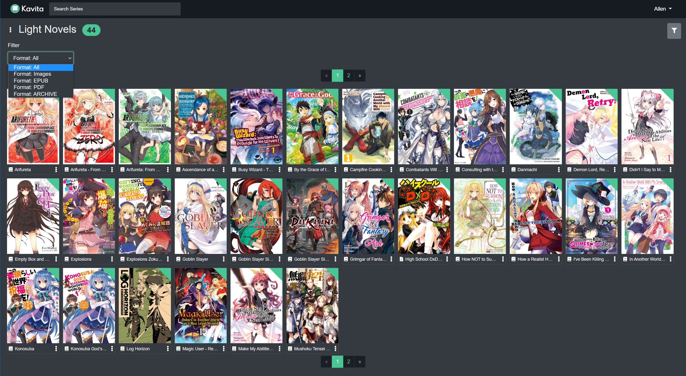

# Filtering
Filtering allows the user to select the type of content displayed in a Library
Select the Funnel at the top right to open the Filtering options

Use the drop down menu to select the file type desired
