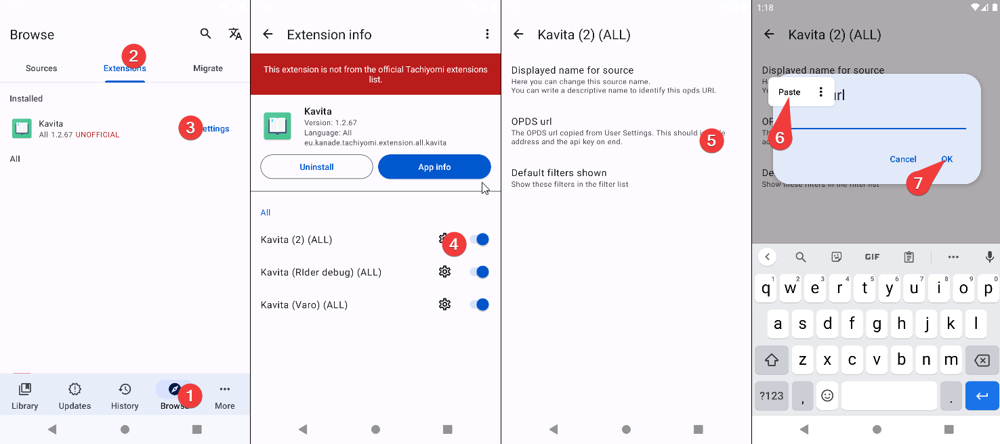
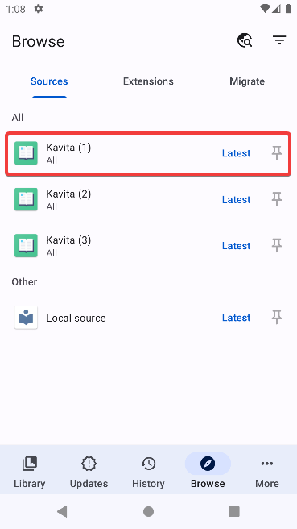
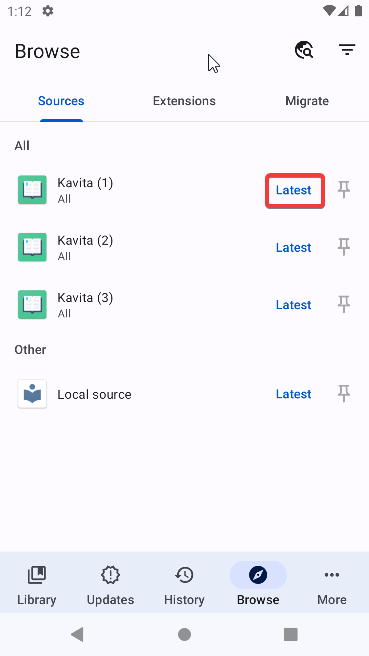

### Guide Overview
* Installation
* Setup
* Usage
* Customization Guide
* Sync Progress with Kavita

## Installation

## Setup

To make the extension link with your Kavita instance we need the OPDS URL.
The steps to get the OPDS URL are:

Access your Kavita instance from your web browser and login
1. Access your Kavita user dashboard
2. Switch to "3rd Party Clients" tab
3. Copy the text under OPDS URL

Once the  OPDS URL is obtained open Tachiyomi
4. Go back to Tachiyomi extensions tab
5. Tap Kavita
6. Tap the gear icon in one of the sources. (sources explained in customization)
7. Tap OPDS URL setting
8. Paste your OPDS URL (If your OPDS URL address differs from your Kavita address, change it.) tap ok
10. Restart Tachiyomi
11. Browse your library 
12. If you get this error: "Expected URL scheme 'http or 'https' found but no colon was found" restart Tachiyomi once more
A graphical tutorial:

## Usage
### Browse all your libraries

### Browse recently added

### Filters
Filters only work when browsing all libraries.

## Customization
### Change source name
### Remove filters from filter list

## Sync Progress with Kavita

