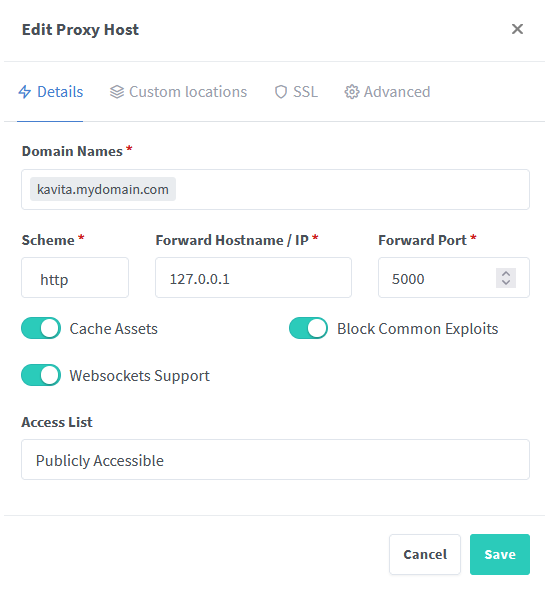
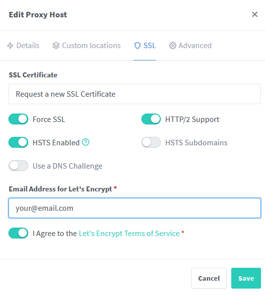
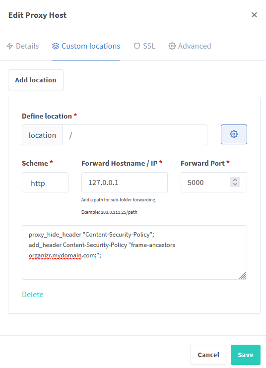

 ### NGINX Proxy Manager with Let's Encrypt

* Head over to your Nginx Proxy Manager page 
* Add a new Proxy Host

* Set the following:
  * Domain Name: to the subdomain you want to use for Kavita
  * Scheme: http
  * Forward hostname/IP: your kavita IP 
  * Forward Port: Your kavita port
  * Cache Assets: Optional
  * Websockets Support: enabled
  * Block Common Exploits: enabled
* Click Save, then edit the proxy host you just created
* Head over to SSL, and choose "Request a new SSL Certificate"

* Set the following:
  * Force SSL: enabled
  * HSTS: enabled
* Click Save

### Adding Organizr iframe support in NGINX Proxy Manager:

* Edit your Kavita proxy host
* Click on "Custom locations" and add a locations
* Click the Gear icon on the right side of the location box to open the Advanced menu
* Set the following:
  * location: /
  * Scheme: http
  * Hostname: your Kavita IP
  * Port: Your Kavita Port
  * Advanced field: 
  proxy_hide_header "Content-Security-Policy";
  add_header Content-Security-Policy "frame-ancestors organizr.example.com;"; 