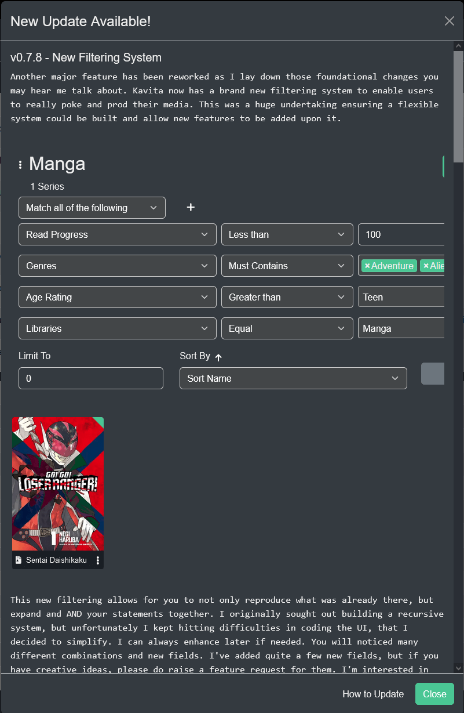
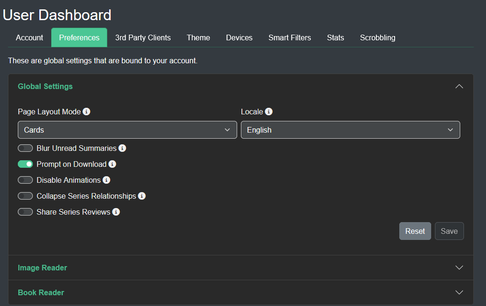

#### Page overview

- [Admin Dashboard](#admin-dashboard)
  - [General Tab](#general-tab)
  - [Users Tab](#users-tab)
  - [Libraries Tab](#libraries-tab)
  - [Media Tab](#media-tab)
  - [Email Tab](#email-tab)
  - [Tasks Tab](#tasks)
  - [System Tab](#system-tab)
- [User Settings](#user-settings)
  - [Account Tab](#Account)
  - [Preferences Tab](#preferences)
  - [3rd Party Clients Tab](#3rd-party-clients)
  - [Themes Tab](#themes)
  - [Devices Tab](#Devices)
  - [Smart Filters Tab](#Smart-Filters)
  - [Stats Tab](#stats)
  - [Scrobbling](#scrobbling)

 

## Admin Dashboard
### General Tab 

#### Base URL
Use this to if you want to host kavita in a sub-folder URL, ie) yourdomain.com/kavita 

Most commonly used in sub-folder reverse proxy setups. 

#### Port and Logging level 
There are a multitude of settings that can be changed. The Port and Logging Level require a manual restart of the server to take effect. On docker these settings are not configurable from the web UI. 

#### Days of Backup
The number of backups to maintain. Default is 30, minimum is 1, maximum is 30.

#### Cache Size
Amount of RAM to allocate for keeping heavily used API's in memory. Defaults to 75 MB. 

#### On Deck Last Progress (days)
Adjustable number of days before removing a series from "On Deck". Setting this to a higher value will prevent series from falling off with inactivity. 

#### On Deck Last Chapter Add (days)
The number of days since last progress before kicking something off On Deck.

#### Stats Collection

By default, Kavita will collect anonymous usage data on your installation. This includes information on certain features used, number of files, OS version, Kavita install version, CPU, and memory. Stats collection will run after 24 hours in order to give you time to opt out. 

You can opt out at any time by turning off "Send Data" from the Admin Dashboard. All data is anonymized and contains **no information about your filenames or IP**.

The Kavita team actively uses this data to help design the UX and plan enhancements. If you chose to remain opted-in, thank you. It really helps in the design and planning effort. You can see exactly what data we collect [here](https://github.com/Kareadita/KavitaStats/blob/main/KavitaStats/Entities/StatRecord.cs).

Check the [FAQ](https://wiki.kavitareader.com/en/faq#q-does-kavita-collect-any-data-on-me) to see an example of submitted data. 

#### Enable OPDS support

You can enable OPDS for your Server here. See this [page](https://wiki.kavitareader.com/en/guides/settings/opds) for how it works.

#### Folder Watching

You can turn on or off the folder monitor system wide here. Allows Kavita to monitor Library Folders to detect changes and invoke scanning on those changes. This allows content to be updated without manually invoking scans or waiting for nightly scans.

! Note: The folder monitor only triggers once every 10 minutes before processing changes. That means addition / removals won't be instant. 

 

### Users Tab
From the Users Tab, admins can see the pending invites to their server and their active users. 

They can quickly see information around them and modify their password, delete the user, or edit their library access or roles.

An admin cannot use this screen to modify their own roles (admin role will always have all applicable permissions) or library access (admin always has full access).

An admin can use the user settings page to change their password.

 

### Libraries Tab
Adding and Editing Libraries is covered [here](https://wiki.kavitareader.com/en/guides/first-time-setup#adding-a-library-to-kavita).

 

### Media
From the Media Tab, admins can set server-wide settings for saving media formats. You can pick from PNG, AVIF or WebP.

You should check the compatibility of the devices and browsers your users have before picking a format:
* [Can I use WebP](https://caniuse.com/webp)
* [Can I use AVIF](https://caniuse.com/avif)

WebP offers impressive compression and performance with the only draw back of limited support on older iOS devices.

#### Cover Image Size
This setting allows you to pick a larger resolution than the default 320x455. The options are:

* Default - 320x455
* Medium - 640x909
* Large - 900x1277
* Extra Large - 1265x1795

! Note: Changing the Cover Image Size to something larger than default will impact loading time of images, especially over remote connections. 

!!! Note: Changing the above settings will not do a conversion. Once changed, use [Tasks](#tasks-tab) tab to run the conversion job for all existing Bookmarks and covers.

#### Media issues

If kavita has any problems reading the files as it scans them, those issues will show up here. This list does not automatically clear. Once you fix the files, press the `Clear Alerts` button. If any issues are found on the next scan, they will be shown again here. 

Some common issues are:

 * A local file header is corrupt.
	* Fix = The zip file is damaged and can't be opened.
 * Unknown Rar Header: ##
	* Fix = The rar file is damaged and can't be opened.
 * EPUB parsing error: 'nav' element in the navigation file does not contain a required 'ol' element.
	* Fix = You have an invalid table of contents or multiple nav elements in your table of contents file
 * EPUB parsing error: 'li' element in the navigation file must contain either an 'a' element or a 'span' element.
	* Fix = The table of contents is not following spec. Repack with Sigil or Calibre to fix.
 * End of central directory
	* Fix = Bad archive, repair or replace. 
 * Incorrect EPUB navigation point: point ID is missing.
	* Fix = Bad internal metadata for the epub making it unable to be parsed. Use Sigil or Calibre to fix. 

 
 

### Email

 

In this tab, you can configure the email service Kavita uses for Send To device, User registration, and Forgot Password. By default, Kavita uses an out of the box solution hosted by Kavita's developer. This is an email account which is not maintained and emails are deleted automatically. However, if you want to run your own instance, you can, by following the instructions [here](https://wiki.kavitareader.com/en/guides/misc/email).

### Tasks
In this tab, you can download logs, backup the database, check for updates, and manually Clear Cache. 

You can also specify when you want the library to scan itself and make backups.
If Library Scan is set to Daily, it will start at midnight in your timezone. If set to Weekly, it will scan at midnight on Monday night. 

 >>>System Cache is cleared automatically after a Library Scan and as a system function each night.

!!! Note: Manually clearing system cache while other users are reading on Kavita will incur a one-time loading during the reading experience.

#### Remove want to read
Kavita will remove any series from a user's want to read list, where the series has the Publication Status Completed (this implies everything is within kavita and no more issues will be released) and the user has fully read the series.

#### Checking For Updates
Kavita offers a quick way to see if a new version is available. From the Tasks tab, click Check for Update. A modal will appear if an update is available where you can read the new features and fixes and click Download to open Github and download the updated version. If you are on Docker, there is no Download button. Please pull the latest image yourself. 

 

### System Tab
Under the System Tab, admins can track what version Kavita is running

Under the More Info section are links to Kavita-related websites. [Donations](https://opencollective.com/kavita) are very appreciated and directly support development and web hosting. If you need to report an issue please visit the [GitHub](https://github.com/Kareadita/Kavita/issues) page. If Kavita is missing a function please visit the [Feature Request](https://feats.kavitareader.com/) link and make a new request, or vote on one you support.  

 

## User Settings
To access the user settings page, which holds the all settings for the logged-in user, you can use the nav bar dropdown on your username and select "User Settings". These settings apply to the logged-in user and will not affect any other user.

### Account

This section is for managing your kavita account settings such as email address, account password, age restrictions and scrobbling providers for use in Kavita+. 

### Preferences
In this section, the user can configure site-wide preferences like default how the chapters/volumes are displayed (cards/list) or to blur the summaries descriptions.

#### Reading Settings
In the reading section, you will find all the options for the manga reader and the book reader. You can customize these as you like and they will apply on any of your devices. You can read more about each reader's setting [here (manga)](https://wiki.kavitareader.com/guides/webreader) and [here (book)](https://wiki.kavitareader.com/guides/bookreader).

## 3rd Party clients
Kavita provides multiple ways to connect to your server from external applications. You can find them below:

[Generic (OPDS)](./opds)

[Tachiyomi](../06.misc/tachiyomi)

### Themes
As of v0.5.2 Kavita allows for custom themes. We have opened up some elements to change via CSS variables. Please read the Themes page below for further info:

[Themes](./themes)

#### Devices

 This section is for you to setup devices that cannot connect to Kavita via a web browser and instead have an email address that accepts files. 
 
 You can setup predefined email addresses to use with kindles, kobo or pocketbook devices. 
 
 !!! Note: You need to setup and run your own kavita email instance for this to work. You can not use the default email service for sending files to your devices. 

#### Smart Filters

The list of smart filters you have created on your account will appear here. You have the option of deleting them if you no longer need them. 

### Stats

Your individual stats customized just for you are displayed here. 

## Scrobbling

#### Scrobble History

Here you will find any scrobble events linked with your account when using the Kavita+ feature. All events that have been processed will clear after a month. 

#### Scrobble Holds

Any series that you block scrobbling from on the series page will show up here as a hold. You can remove a series at any time and the next scrobble-able event (reading progress, rating, want to read status) will trigger events.

### Reading Settings
In the reading section, you will find all the options for the manga reader and the book reader. You can customize these as you like and they will apply on any of your devices. You can read more about each reader's setting [here (manga)](https://wiki.kavitareader.com/guides/webreader) and [here (book)](https://wiki.kavitareader.com/guides/bookreader).

 
