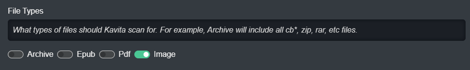
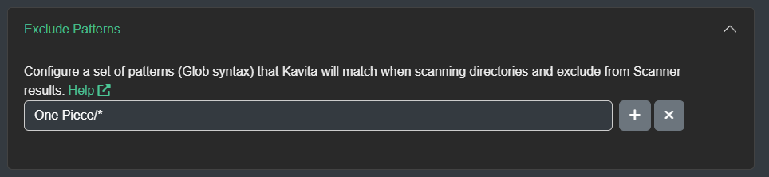

## Excluding File Types
Kavita supports many different file types and by default will see them, but that might not be a good feature in some situations, where programs like Mylar may create sidecar image files. In order to ignore these, you can use the file types controls in Library Setting's Advanced tab. From here, you can turn on/off different types of files. For example, you can turn off all different images from the whole library. This includes what is supported now and in the future. 

## More Advanced Exclusion
Sometimes file types isn't enough, you need to ignore folders. You can do this with Kavita's Exclude Patterns. Exclude Patterns are a list of Glob syntax patterns that will apply at each level of the scanning process. 

For example, in the image, any file within a folder named `One Piece` will be ignored. There are a few different special characters to power this, shown below.

## What is the basic syntax
* The `*` character is a wildcard.
* Patterns without the forward-slash ' /' character (e.g. `*.cbz`) match filenames
* Patterns with the forward-slash '/' character (e.g. `somedir/*`) match directory and file patterns

For advanced syntax please refer to the [library description](https://github.com/dazinator/DotNet.Glob/blob/develop/README.md#patterns)