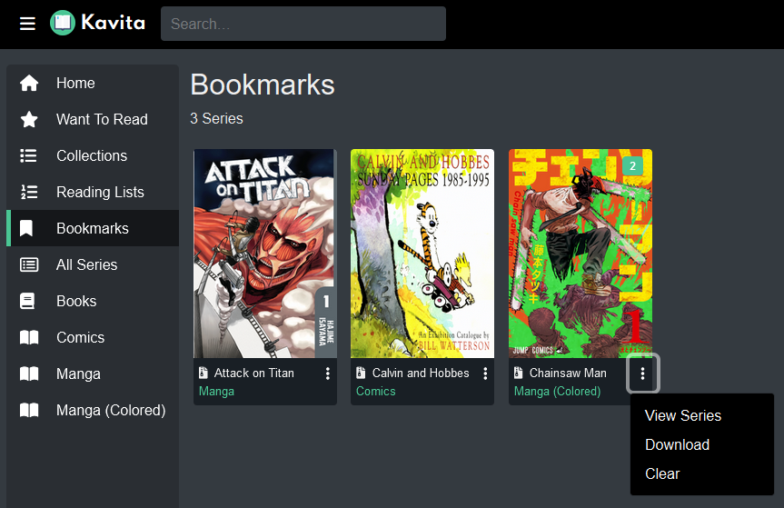
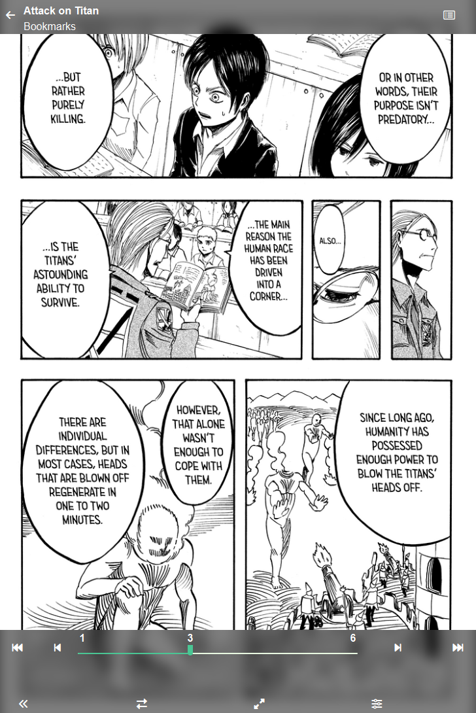

Bookmarks allow you to save individual pages you want to revisit later. They can be accessed from the Bookmarks Library.

From here, a series' bookmarks can be viewed by clicking its card. 

#### Removing Bookmarks
- To remove an individual bookmark, navigate back to the original file (the "View Series" button is useful for this) and remove the bookmark from the page.
- To remove all bookmarks from a series, open the context menu and click "Clear".

#### Downloading Bookmarks
- Bookmarks can be downloaded from each series' context menu by clicking "Download".
- If you have access to the filesystem, bookmarks can be downloaded from `config/bookmarks/`. This is the default directory and can be changed from the Admin Dashboard.

