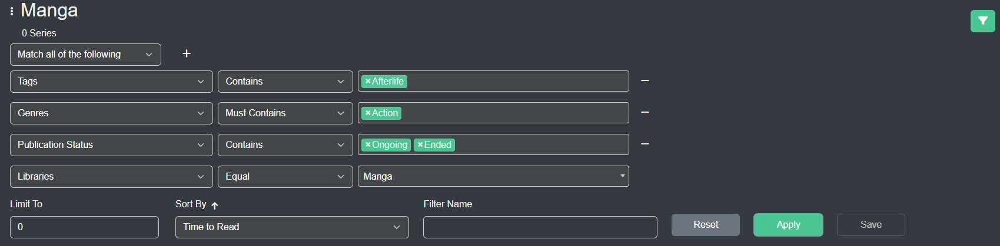
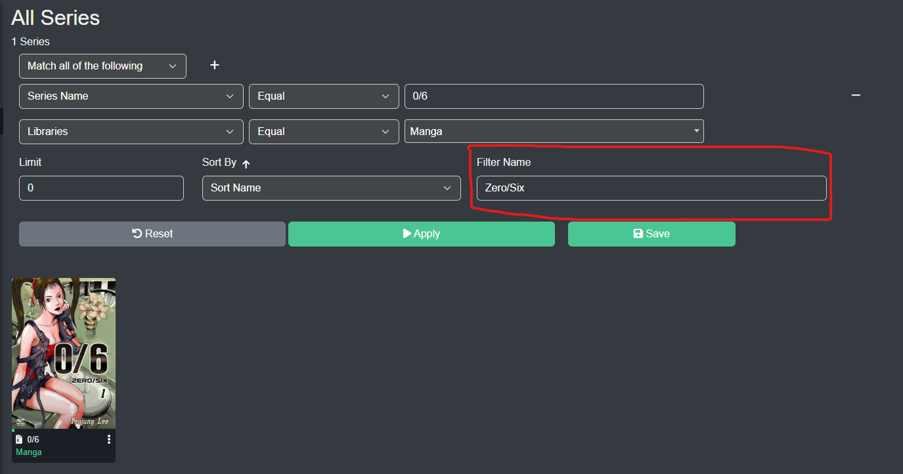

## Metadata Filtering
Kavita (v0.7.8+) has a rich metadata interface which allows you to build complex filters to find exactly what you're looking for. The system allows for you to build a series of statements that AND or OR together with custom sorting and a limit feature (for those that have large libraries). 

### Filter Fields
| Field           |       Field Type     |          Description            |
| ------ | ----------- |----------- |
| Series Name 				  | String | The Name of the Series | 
| Summary 				  | String | The Summary of the Series | 
| Path 				 | String | The file path to the highest level of the Series | 
| File Path 				  | String | The full file path for any file within the Series (note: this is slower than other fields) | 
| Read Time 				  | Number | Number of hours to read the Series | 
| Release Year 				  | Number | The Release year of the Series (minimum from all chapters) | 
| Read Progress				  | Number  | Decimal percentage of Series that is read by user | 
| User Rating 				  | Number | User Rating percentage of Series by user | 
| Publication Status 				  | Single/Multi Select | Publication Status of Series (ie Complete, Hiatus, etc) | 
| Languages 				  | Single/Multi Select | Language of Series | 
| Age Rating 				  | Single/Multi Select | Age Rating of Series | 
| People* 				  | Single/Multi Select | Person of some Role that is on the Series | 
| Genres 				  | Single/Multi Select | Genre in Series | 
| Tags 				  | Single/Multi Select | Tag in Series | 
| Collection Tag 				  | Single/Multi Select | Series that belongs in a Collection | 
| Format 				  | Single/Multi Select | Series Format (epub, archive, etc) | 
| Want To Read 				  | Boolean | If Series is in user's Want To Read list | 
| Reading Date 				  | Date | Latest date the Series was read by the user | 

* People refers to fields such as Translator, Editor, Inker, etc

#### Filter Combination
| Filter Combination           | Applies on          |          Description            |
| ------ | ----------- |----------- |
| `Equal`      | String/Number/Multi Select              |                 Equals exactly                  |
| `Not Equal`     | String/Number/Multi Select            |                  Doesn't Equal                  |
| `Begins With`     | String        |                 Starts with string                 |
| `Ends With`     | String        |                 Ends with string                 |
| `Matches`      | String             |                 Applies a search-like match on the field                   |
| `Is Before`     | Date        |                Date is before X                 |
| `Is After`     | Date        |                Date is after X                 |
| `Less Than`     | Number        |                Less than X              |
| `Less Than Equal`     | Number        |                Less than or Equal to X              |
| `Greater Than`     | Number        |               Greater than X              |
| `Greater Than Equal`     | Number        |                Greater than or Equal to X              |
| `Contains`     | Multi Select         |                The Filter Field contains at least one entry of what is passed             |
| `Must Contains`     | Multi Select         |                The Filter Field contains all of what is passed             |
| `Must Not Contains`     | Multi Select         |                The Filter Field contains none of what is passed             |

### Smart Filters
A Smart Filter is essentially a saved filter (best created on All Series page). The underlying filter can be loaded and changed and anything that is bound with the Smart Filter will automatically be reflected of the new filters. Once you have a Smart Filter created, check out [Customization](https://wiki.kavitareader.com/en/guides/customization) to learn about how you can utilize the filters.

To create a Smart Filter, just add a name in the Name field and hit Save. Smart Filter names must be unique per user. Smart Filters are user-bound. 

