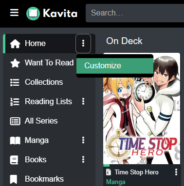
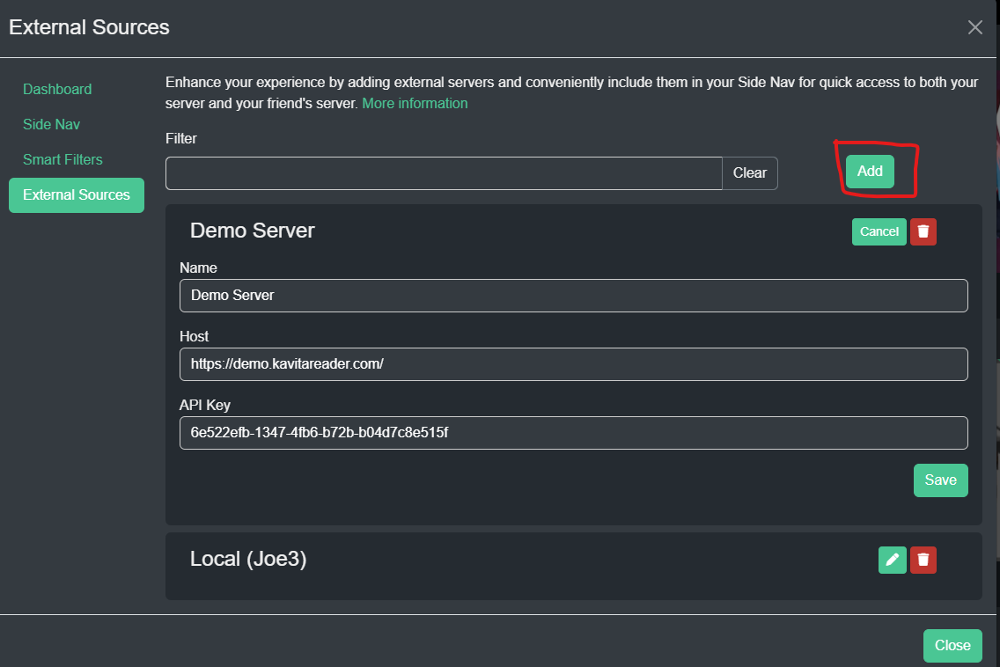
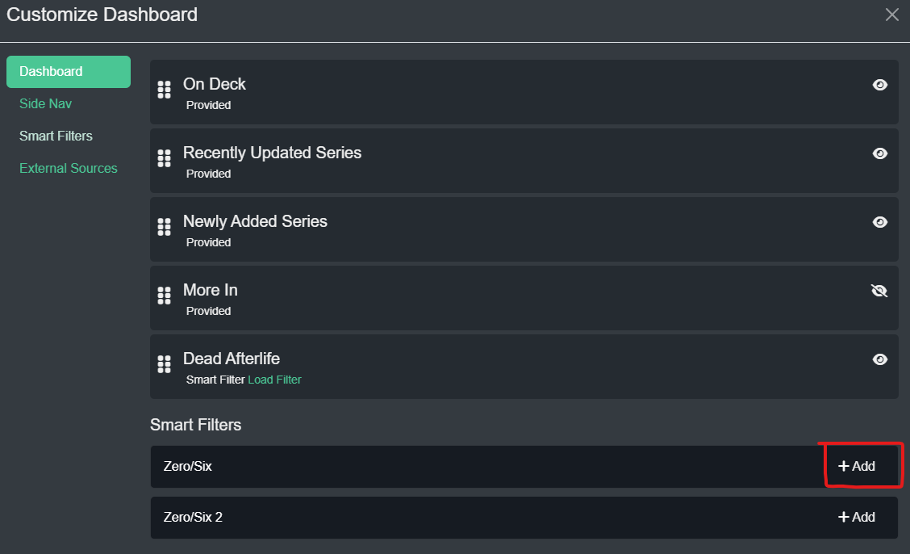
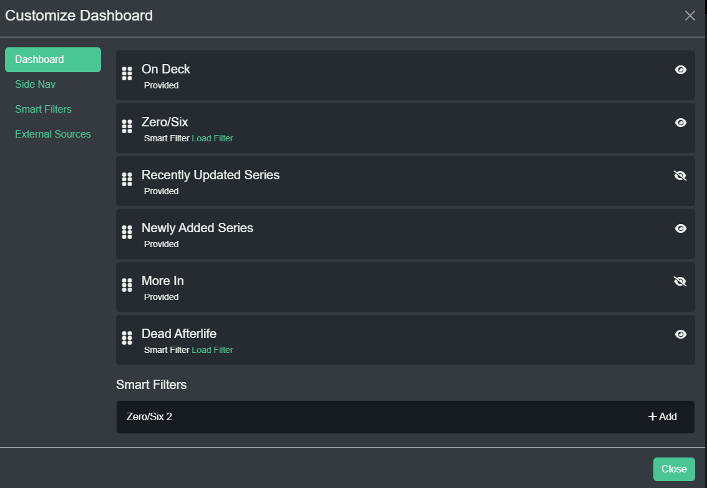
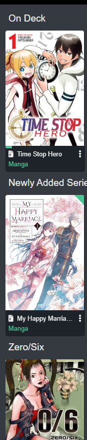
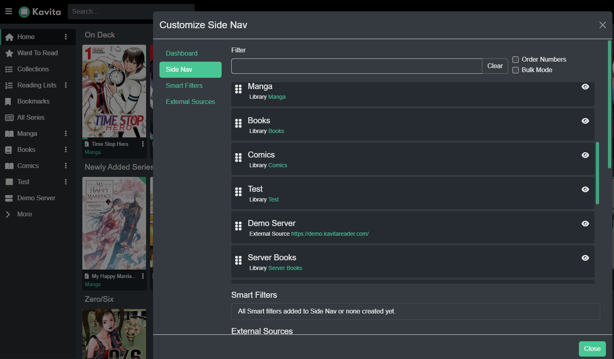
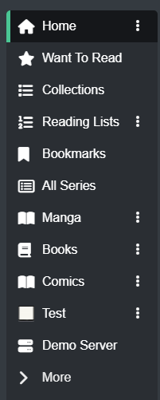
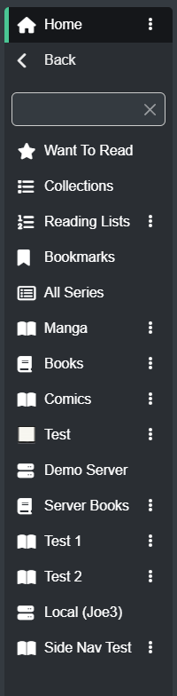

Here you will find the major UI Customization recently released in Kavita v0.7.9. 

To access any customization in this section, you can click the actionable (...) from your side nav.

### Smart Filters
A Smart Filter is essentially a saved filter (best created on All Series page). The underlying filter can be loaded and changed and anything that is bound with the Smart Filter will automatically be reflected of the new filters. 

To create a Smart Filter, just add a name in the Name field and hit Save. Smart Filter names must be unique per user. Smart Filters are user-bound. 

### External Source
An external source is essentially another Kavita instance that you have access to (or your own with a different user).  To get started, access the customization modal from your side nav then click External Sources. Click Add and fill in the required information. The name is for what is rendered on the side nav, API key is for your user on that server, and the domain. Once created, you can bound it to your Side Nav, like you'd do a Smart Filter. Note that this is explicitly for Kavita servers and will drive new enhancements in future updates. 

### Dashboard
Kavita allows each user to customize their own Dashboard by customizing the order of Streams, turning them on/off, and creating a Stream from a Smart Filter. These customizations along with Smart Filters gives each user the ability to really customize Kavita to their liking. Don't like the way Kavita's On Deck works? Build your own, turn off Kavita's and place your own there. The same features of clicking on the Stream's title to load a full page filtered view still works for everything.

! This page is WIP, there may be duplicate data or changes until v0.7.9 releases
In order to customize your dashboard, click the actionable menu from the Home side nav and click Customize. From here you will see a list of Dashboard Streams (a stream is a flow of items within Kavita). Kavita comes out of the box with some custom coded streams, like On Deck or Recently Updated Series. However, not all users like the logic Kavita uses and may want their own. This is where Smart Filters and Dashboard customization plays a place. In this screen you can:
- Reorder Streams
- Disable Streams
- Add Existing Smart Filters to the Dashboard 

! Note: Smart Filter based streams will run the smart filter query, so you can edit the smart filter at any given time (via User Settings -> Smart Filter or Clicking on the stream title). 
! Note: The order of your dashboard will change your OPDS feed. A smart filter section will also be available if you have any.

### Side Nav
Kavita also allows each user to customize their own Side Nav. Like with the Dashboard, you can reorder, turn on/off side nav items, Smart Filters and External Sources. Side nav customizations are per-user. 

The side nav also will only show 10 items + Home item at any given time, everything else is shown under the fold. You can click More and see these extra items at any time. 

