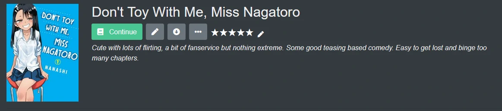
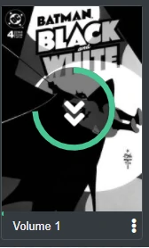

Page overview 

<code style="all: unset">├── </code>[Series details](#series-details) 
<code style="all: unset">│      </code>     + Overview of a series page 
<code style="all: unset">│      </code>     + Edit Series 
<code style="all: unset">│      </code>     + Ratings and Reviews 
<code style="all: unset">│      </code>     + Info Modal 
<code style="all: unset">├── </code>[Filtering](#filtering) 
<code style="all: unset">├── </code>[Downloading](#download) 
<code style="all: unset">├──</code> [Collections](#collections) 
<code style="all: unset">└── </code>[Reading list](#reading-list) </code>

 

## Series Details
Series detail is the main page where you can see a series and all the entities related to it. As you can see below, there are a number of controls. To start, the series cover image is displayed along with the title of the series. From the buttons you can [Continue Reading](#continue-reading), [Edit Series](#edit-series), Download the whole series, or add/edit your [rating and review](#rating-and-reviews).

Below this section is the metadata and collection tags. Collection tags can be clicked to view all items in that collection, while metadata tags can be clicked to open a filtered search query for said filter. For example, if you clicked Cover Artist "Cory Walker", then a search against anything that the user has access to that is tagged with Cover Artist of Cory Walker will be shown.

 

### Continue Reading
To start reading you can either click the individual volume or chapter or let Kavita resume you where you left off by clicking "Continue".
Continue will open the last chapter that you have progress on or the next (if the last one was finished).

If you don't see Continue, this means you haven't started reading yet. Press "Read" to start reading from the first volume or chapter.
 

 

### Edit Series
This opens a menu with 3 tabs

**General** 
It's possible to change information of the series such as name, collections or summary.

**Cover Image** 
Override the cover of the series without modifying any file.

**Info** 
This tab is useful to troubleshoot problems related to name parsing. It list all files that are part of this series.

 

### Rating and Reviews
Kavita allows for you to track your rating and provide a review for yourself all within Kavita. Currently Kavita has it's own, separate system, however Scrobbing and Syncing to external sources is planned.

To provide a rating, click the star icons. When you first provide a rating, a prompt will ask if you want to review. Adding a text based review is optional. If you clicked no and want to add or edit your rating or review, you can click the edit icon displayed next to the star rating. 

 

### Info Modal
Kavita has grouping which sometimes can be confusing, did a file get grouped properly? How can I check? This is where the Info modal comes from. From a Volume/Chapter, use the context actions menu to select Info. From Series detail, you must be an admin and can use the Edit button.

#### Volume Info

The volume info has some extra functionality. First, as you can see, we have individual chapters that are grouped into one virtual volume. When reading, you can jump chapter to chapter, but what if you want to re-read chapter 2? This screen will let you by clicking the cover image, which will open the reader directly on that chapter. Likewise, what if you've already read chapters 1-4 and want to quickly mark them as read? Using the context action button next to the Chapter title, you can now: 
* Mark as Read
* Mark as Unread
* [Download](#downloading)

 

## Filtering
Filtering allows the user to select the type of content displayed in a Library
Select the Funnel at the top right to open the Filtering options

This will open the filtering section to allow you to explore your library. The filtering screen is dynamically created based on the screen. For example, on the below example, the Libraries is already pre-selected as Comics, since the section was opened on the Comics library view. If on a collection page, then the collection page will be pre-selected. 

From this page, you can select a set of tags to search against. The search will always OR each field. All fields will react to the selected libraries (aka if there are no writers in library comics, writers will show up with nothing, even if there are defined writers in another library) except for Collections and Formats. Those will always show all options available. Rating field will show as the minimum rating. If you select 3 stars, then anything with 3 or more stars will be returned.

 

## Download
If a user has the Download role, they can download files from Kavita. Because Kavita uses a grouping mechanic, the downloads will mimic this structure. From any Series, Volume, or Chapter, a user can kick off a download via the context menu. If the underlying file is just one individual file, it will be sent as is, otherwise, the files will be grouped in a zip and downloaded. 

Downloads may take longer than expected to process. Kavita will show a spinner on the item you are attempting to download from. 

 

## Collections
Collections will make this guide longer so a sub-page has been created.
[Click here to go to Collections Wiki page]()

 

## Reading List
A reading list is an ordered list of chapters that can be of mixed media types. 

Only one user can see its reading lists except if an admins promote a reading list so all users can see them, but not edit them.

Users can read through a reading list and the readers will transition automatically between the different types of readers accordingly to the file type. 
For example you can have a list with the following items: `Manga chapter -> Manga chapter -> Book chapter -> Manga` You can read them without closing the reader. 

The order can be manipulated via drag and drop or by using input boxes on right hand side to manually adjust the position. Position changes save automatically.

Lastly, if you are using a reading list to track new chapters added to your server and want to quickly clear it out when you've gone through them, there is a "Remove Read" button which will remove any fully read chapters from the list. 