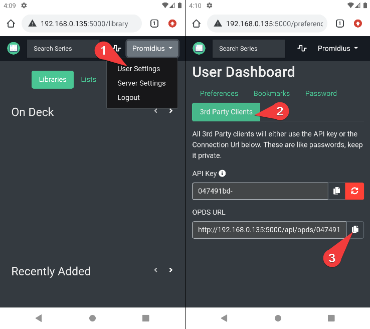
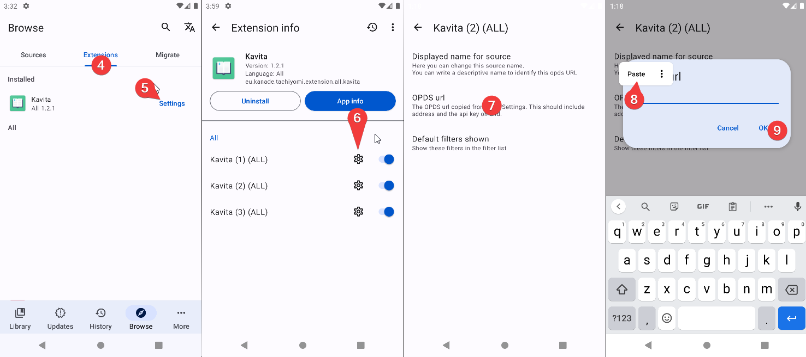

### Guide Overview
* [Installation](#installation)
* [Setup](#setup)
* [Usage](#usage)
* [Customization Guide](#customization)
* [Sync Progress with Kavita](#sync-progress-with-kavita)

## Installation

**First of all make sure Kavita is updated**

1. After that, after opening Tachiyomi, go to Browse in the lower nav.
2. Select Extensions tab at the top of the screen.
3. Now you can either scroll down untill you find or hit the search icon and write Kavita in it.
4. Once you find or search tap install.
5. In the confirmation menu hit install again.

## Setup

To make the extension link with your Kavita instance we need the OPDS URL.
The steps to get the OPDS URL are:

Access your Kavita instance from your web browser and login
1. Access your Kavita user dashboard
2. Switch to "3rd Party Clients" tab
3. Copy the text under OPDS URL

**Once the  OPDS URL is obtained open Tachiyomi**
4. Go back to Tachiyomi extensions tab
5. Tap Kavita
6. Tap the gear icon in one of the sources. (sources explained in customization)
7. Tap OPDS URL setting
8. Paste your OPDS URL (If your OPDS URL address differs from your Kavita address, change it.)
9. Tap ok
10. Restart Tachiyomi
11. Browse your library 

## Usage
### Browse all your libraries

### Browse recently added

## Customization
#### Change source name
##### First of all. What is a source. 
Once installed the user has access to 3 sources.  
This means you can have access to 3 different Kavita servers. 
On each source you can setup different OPDS URL and different filter preferences. 
By default these are differentiated with a number. 1,2 and 3. 
You can change each identifier with your own. 

##### To change the name of the source 
Follow the same process used for OPDS but tapping "Displayed name for source" instead.
#### Remove filters from filter list
Same process used for OPDS but tapping "Default filters shown" instead.
This will hide or show filters appearing in filter list. 
To hide one filter just uncheck the checkbox

## Sync Progress with Kavita
**Not implemented yet**

