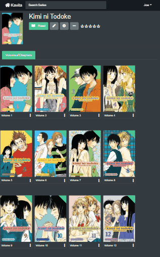

When in the Web Reader click of tap in the center of the screen to bring up the Menu. In the top left the Arrow will let you exit the Manga/Comic and the Title, Volume, and Chapter of what you have open is displayed.
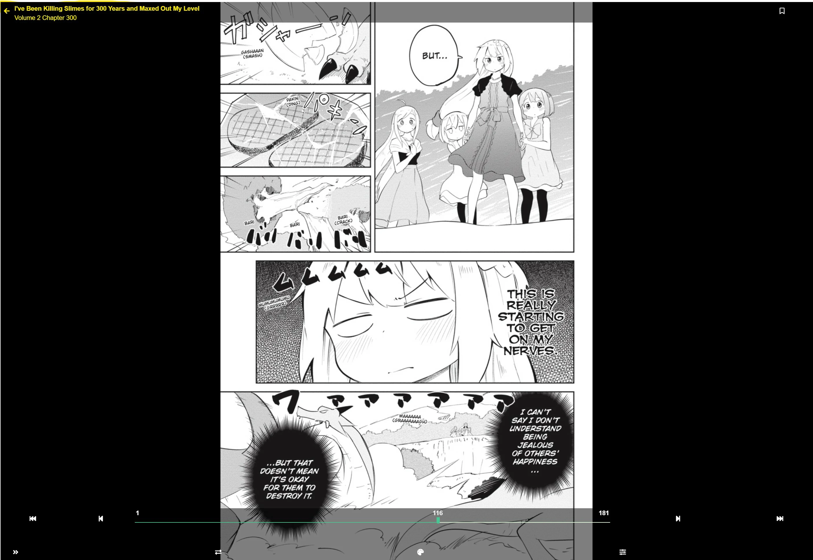
#####**Previous Chapter** or **Volume**
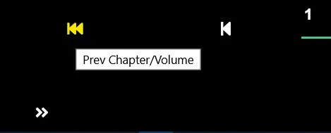
#####**First Page**

#####**Last Page**

#####**Next Chapter** or **Volume**
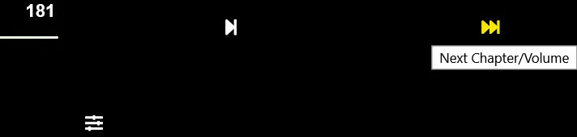
#####**Reading Direction**: Left to Right or Right To Left

- Reading Direction changes which side of the screen you need to press to move to the next page. By default you are reading Left to right, meaning the right side (as shown in Pagination below) will move you to the next page. You can toggle to Right to Left and hence the left side will progress to the next page.

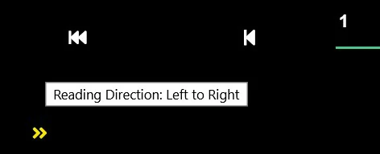
- When changing the Reading Direction option Colors will briefly highlight the Pagination (page turn) areas.
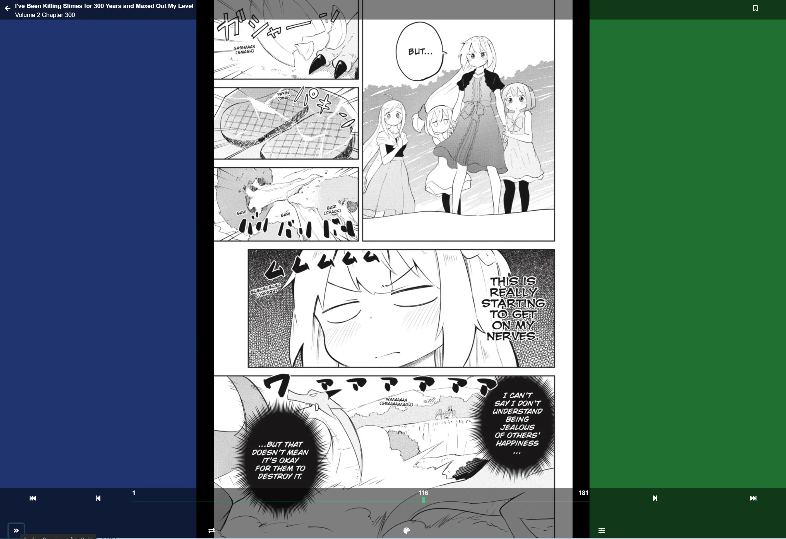
#####**Reading Mode**: is either Side to Side, Up and Down, or Webtoon mode
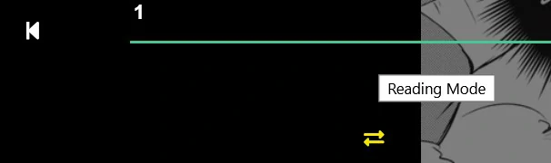
#####**Color Options**: None, Dark, or Sepia 
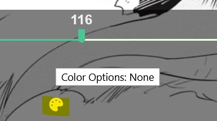
#####**Web Reader Settings**
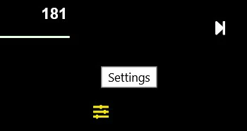
! Note: All Menu options scale with the screen size of your device display.

#####**Image Splitting Options**: Right to Left or Left to Right
- Splitting is the act of taking a spread page (a page that contains both left and right as one image) and virtually splits it so it feels like 2 pages. This is useful if you don't want to scroll while reading on a phone or tablet. Right to Left will split the image so the right side of the image renders first, then the left part as the second page. This is the most common.
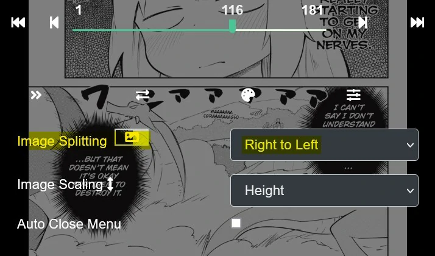
#####**Image Scaling Options**: Height, Width, and Original
- Scaling Options is how the image should be mapped to your screen. Height fits the image to fill the full height of your screen. Width fits to the width (best for reading on a phone) and Original does no scaling and sends the raw image over. Note that the Automatic Scaling Option from User Preferences will choose the best option based on your screen size.
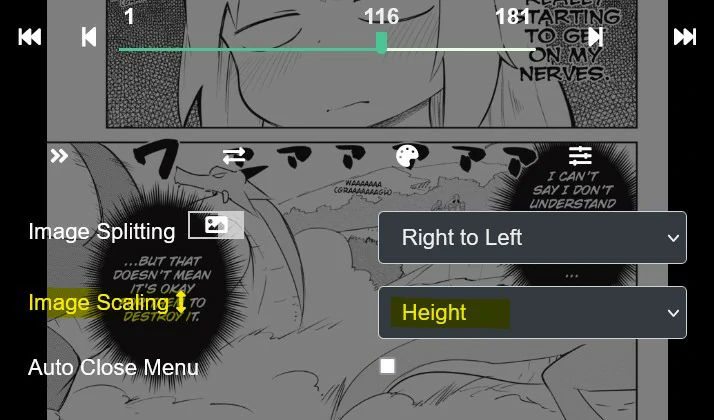
#####**Auto Close the Menu** Check Box

#####**Bookmark Selection** at the top right of each page. For more information on Bookmarks click [here](https://wiki.kavitareader.com/en/guides/contextual-actions#bookmarks)
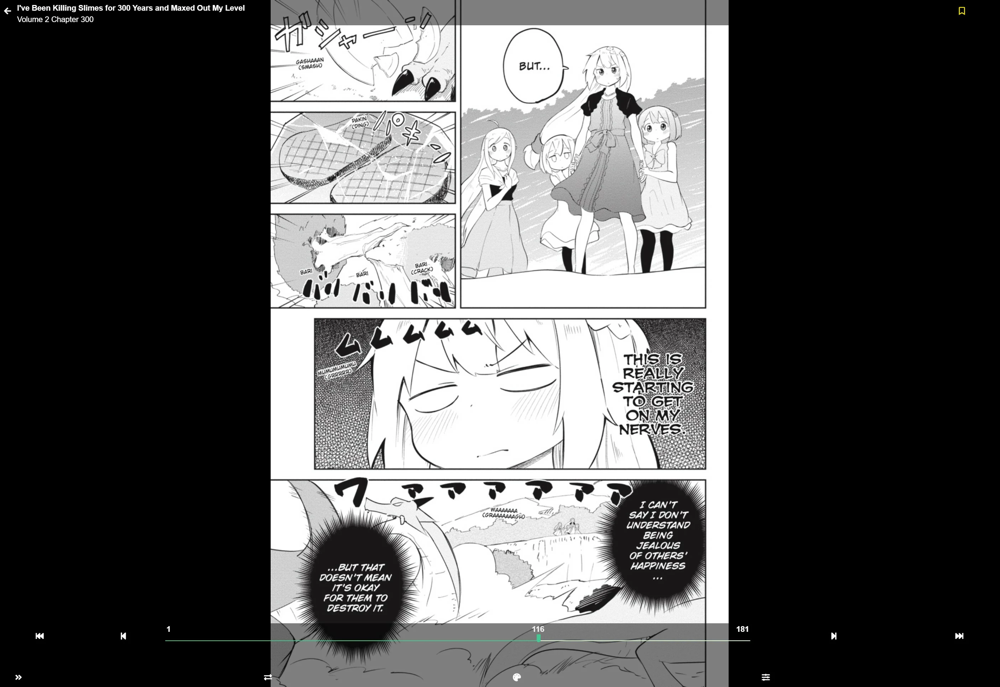

!! Warning: Web Reader menu settings do not persist between reading sessions. Use User Preferences to update for persistence. 

### Keyboard Shortcuts
- LEFT/RIGHT ARROW: Previous/Next Page (assuming left to right reading mode) (Left being Previous assumes Left to Right reading direction)
- UP/DOWN ARROW: Previous/Next Page (assuming using up and down reading mode)
- SPACE: Open Menu
- G: Open Go To Page
- B: Bookmark Current Page
- ESCAPE: Close the reader

### Continuous Reading Mode
The reader provides a few ways to read without having to close the reader to open the next chapter. As shown above, there are Next/Previous Chapter buttons that can be manually clicked and in addition, for non-webtoon (infinite scroll) mode, you can just page like normal and within 10 pages of a chapter boundary, the server will prefetch information needed and tell the server to start caching said files. 

For infinite scroll, due to the nature of the reader, there is a slightly more manual way to trigger the next/previous chapters. You can always use the buttons, however to do it without using the menu is more ideal. Now when the user scrolls to top or last page in the reader, a "spacer" is inserted at the top or bottom respectively. This spacer should show an animation to the user to scroll into it. When that is done, the next chapter is loaded. 

