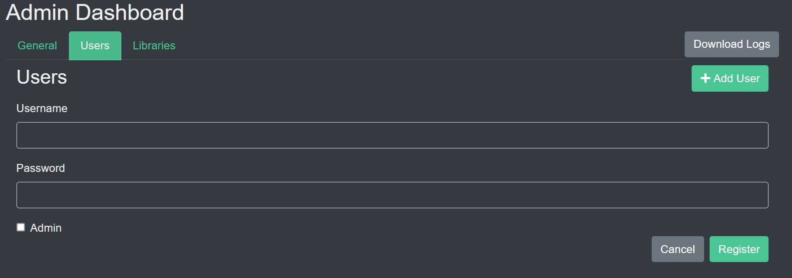
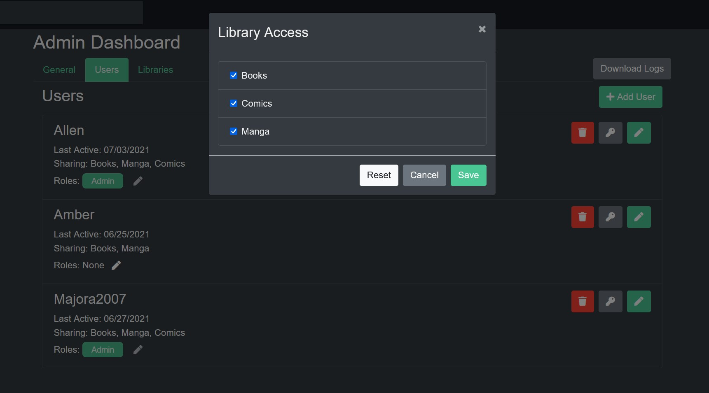

### Adding a User
To add a user to Kavita you must have Admin access. Select Server Settings in the top right Drop Down Menu.

Select the Users Tab and click Add User. Create the unique Username and Password and click the "Admin" check box if you want this user to have Admin privileges. 

!! **Warning**: Users created with the "Admin" flag have complete access to all libraries and can only be Deleted, not edited, even by the main Admin.

Once a user is created you must grant them access to specific libraries using the Pencil Edit button. The Sharing line displays what libraries the user has access to. From this screen, you can edit the password for a user, edit their access to libraries, delete the user entirely or assign them roles. 

### Roles

The only role currently is "Download", which gives them the ability to download media from your server.  See how downloading works [here](https://wiki.kavitareader.com/en/guides/contextual-actions).

