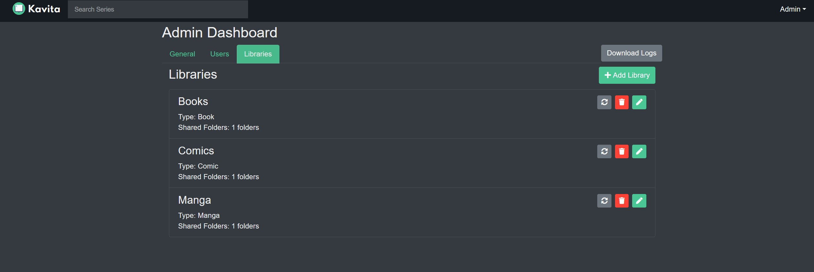

### Adding another Folder to an existing Library

Content can be added to a library from multiple directories as long as the type of content is the same. Libraries can share folders between libraries. For example, I can have a library _Isekai Manga_ and _All Manga_. _Isekai Manga_ can have `/manga/manga 1/` and `/manga/manga 2` while _All Manga_ can have the whole `/manga/` folder. 
The "Shared Folders:" line on the Libraries Dashboard shows have many folders have been added.

To add another folder select the Pencil Edit Icon to the right, and click the plus sign. Below it, you will see the folder(s) already added to this Library.

Each folder has a Share button which can be used to select all content in all sub-folders. However, Clicking on the folder names allows you to drill down further to Share the exact folder you want.

Once a folder is added or removed from a library, a scan will kick off to update the underlying library. 

!!! Note: By default, no users will have access to a newly created library. You must grant permission to access a library from the User Tab. 