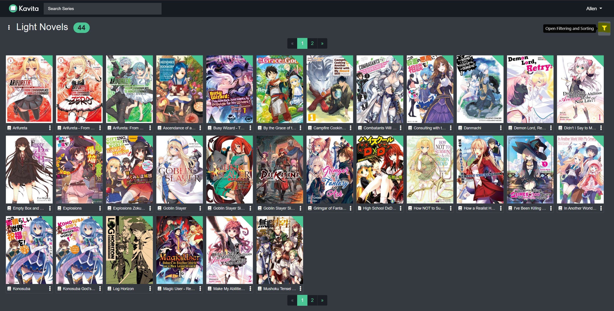

## Filtering
Filtering allows the user to select the type of content displayed in a Library
Select the Funnel at the top right to open the Filtering options

This will open the filtering section to allow you to explore your library. The filtering screen is dynamically created based on the screen. For example, on the below example, the Libraries is already pre-selected as Comics, since the section was opened on the Comics library view. If on a collection page, then the collection page will be pre-selected. 

From this page, you can select a set of tags to search against. The search will always OR each field. All fields will react to the selected libraries (aka if there are no writers in library comics, writers will show up with nothing, even if there are defined writers in another library) except for Collections and Formats. Those will always show all options available. Rating field will show as the minimum rating. If you select 3 stars, then anything with 3 or more stars will be returned.

