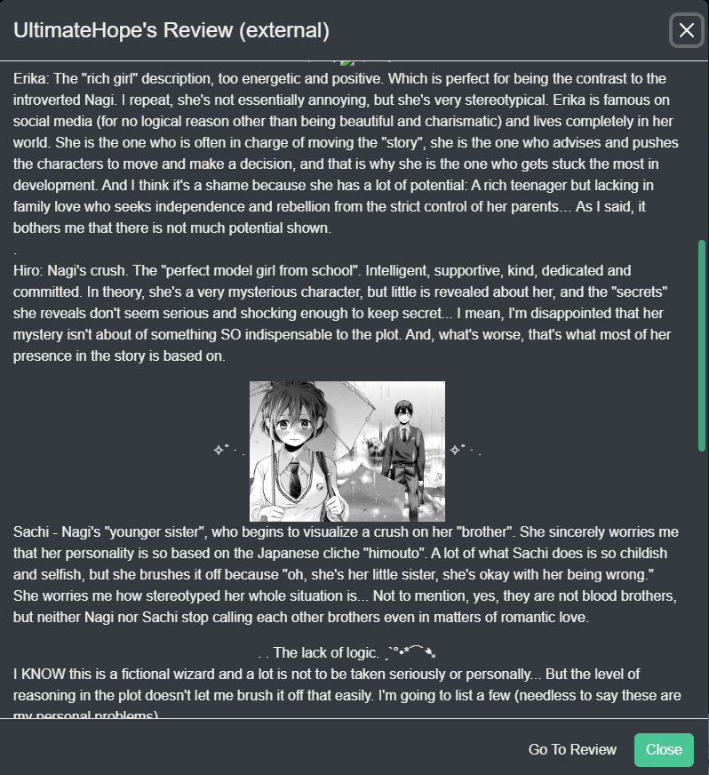

Kavita+ is an **optional** premium service offered by the main developer of Kavita ([majora2007](https://github.com/majora2007)) which unlocks a set of features for your Kavita application. Kavita+ is a way for me to hopefully go full time on Kavita development—think of it as a way to support the development of Kavita while also getting some sweet features out of it. The goal is to not lock all features behind Kavita+, but add features that otherwise aren't feasible in the base product. The base Kavita application will continue to get frequent updates with new features. 

Kavita+ is a monthly subscription for your individual instance and is node-locked. Once active, all users on your server gain the benefit. You can cancel and resume at any time. 

**Current Features:**
- External Series for Admins
  - View Metadata within Kavita (Kavita v0.7.9)
- Remove Donate Link
- Scrobbling Support
  - AniList
- External Reviews
  - AniList
  - MAL
- Recommendations
  - AniList
  - MAL
- External Ratings
  - AniList
  - MAL
  - Google Book (Kavita v0.7.6+) (In trial to see if valuable for members)

**Planned:**
- Non-manga Book Support
  - OpenLibrary to be implemented (in trial)
- Webhook Support
- Find non-owned series by Person (like Authors)
- Collection creation via Stack Monitoring (Stacks are collections on MAL and AniList) (This is being trialed as no API exists)
- Community-Driven Proposed Features (you can submit your ideas [here](https://github.com/Kareadita/Kavita/discussions/2529))

! Note: Kavita+ does not download metadata for your files. This is already available for free via [Komf](https://github.com/Snd-R/komf). Note: A basic proposal has been created to support this, please add your feedback [here](https://github.com/Kareadita/Kavita/issues/2452)

## First time Subscribers
If you are interested, you can use the promo code `FIRSTTIME` for your initial signup for a 2$ discount on the first month/year. If you are an active OpenCollective donator, please contact majora2007 for provisioning. 

## How to Buy
Navigate to Admin Dashboard -> Kavita+ tab. From there, you can purchase a license via the Buy button. A new tab will open prompting you for your pay information. Kavita+ uses Stripe to handling payments. Kavita team does not have any access to your personal information. Please ensure you use a real email, otherwise you will not be able to receive your product key. Upon finishing subscription, you will receive an email from Kavita with your license key. Move to the Activate step.

## How to Activate
From the Admin Dashboard -> Kavita+ tab, press Activate button. This will prompt you for the email you used with Stripe and the License you received via the email. Enter the details and hit save. This will register your Kavita instance with Kavita+ and should reflect instantly. If you ever need to manage your subscription, like cancel it, you can do so via the Manage button. All management is locked around your email. If for whatever reason your license is showing invalid, use the Check button to re-validate the license.

## How to Unsubscribe
If Kavita+ isn't bringing value to you, you can unsubscribe easily via the Kavita+ Tab. Click Manage which will open your Stripe portal and from there you can cancel your membership. You will receive an email stating your subscription has cancelled and until when your Kavita+ membership lasts until. You can use this Manage button at any time in the future to re-activate your subscription. If in doubt, please reach out to [majora2007](https://discord.com/invite/b52wT37kt7). 

### External Reviews
Kavita+ offers external reviews on the Series Detail page. These reviews are aggregated from multiple sources and sorted to try and provide a spectrum of positive, mid and negative reviews. If users on your server have opted into sharing their reviews, they will always show first, then reviews from external sources. Clicking on any review will show you the external review.

### External Recommendations
Kavita+ offers external recommendations on the Series Detail page. The recommendations are aggregated from multiple sources. If the logged in user is an admin with no age restriction, they will be able to see recommendations that are not on the server, otherwise, only series on the server will show (and the usual age restriction or library restriction will apply). 

### External Ratings
Kavita+ offers external ratings. For now, they are just limited to viewing, but may be integrated into activity streams in the future. Here you can see the ratings displayed along side your own review (or lack thereof).

### Scrobbling
Scrobbling is the act of synchronizing certain activities done on a Server, like Kavita, to an upstream provider. As of launch, Kavita+ supports AniList for scrobbling and supports the following events:
- Reading Progress
- Want to Read -> Adds a series to Planning
- Rating a series -> Will map to your rating preferences
- Reviews -> AniList requires reviews be 2200 characters with a tagline of 20-150 characters. If your review doesn't match this, it will not scrobble.

To setup Scrobbling, navigate to your User Settings -> Account tab and click Scrobbling. You can add a token for the scrobble provider. You should see a Generate button. This will generate a token for you. Copy and paste this into Kavita and hit save. Once your token is validated, Kavita will show it as set. Tokens are per-user and Kavita will automatically keep them fresh for you. 

If you do not want scrobbling on a library, as an admin, you can turn it off in Library Settings. If as a user, you want to exclude certain series, you can do that by pressing the scrobbling button on the Series detail page. If you had a series on the scrobble hold list (visible in User Settings -> Scrobbling) and turned it on again, you need to invoke a reading event or rating event, based on whatever you want to scrobble up. You can simply open the reader, go back a page and forward or re-mark an existing item as read.

Scrobbling will always ensure the highest between AniList and Kavita is taken. So if AniList has 10 volumes read and Kavita reports 5, nothing will change. This is to ensure users that use multiple services or has existing history not brought into Kavita do not have any issues with their history. 

! Kavita will scrobble once every 4 hours to AniList

### How to fix bad Matches
As series can often have many names and users may put their own spin on each one, scrobbling might fail to match. In these cases, there are two options: Correct the Series name or Localized Series name to match AniList or add AniList or MAL weblink to the series. Once done, you can clear scrobble errors and wait. Scrobbling should take after this. You may also want to bust cache in Admin -> Tasks, which will clear bad rating, recommendation, and review data for all your users. 

### FAQ
#### Some reviews look broken
This happens due to a bug in AniList's API. I have created an issue and will monitor. This should be rare and you can use Open Review button to read the review in AniList. MAL reviews do not seem affected.

#### Some series cannot be found
This can happen if AniList doesn't have the series (or you need to rename/add a weblink). If AniList doesn't have a series, you can work with them to add the series. 

### I don't see any ratings, reviews, or recommendations
As of Kavita v0.7.4, only series that exist on AniList will provide external data. I am actively scouting for Comic and Book providers (however it looks unlikely) to provide more information. If you think you have something I can integrate with, please raise it on the feature request site.

#### AniList activity feed isn't showing my progress
AniList currently doesn't show activity if only Volumes were read. You can read more about it [here](https://anilist.co/forum/thread/2586). You can validate that the Volumes do update in the Series on AniList. 

#### License already tied to another server
This can happen when you change hardware, OS, or re-install Kavita. Just send an email to kavitareader or reach out directly to majora2007 in discord with your license key and it will be reset. 

#### I have a cool idea
Like all ideas with Kavita, please raise it on [feats.kavitareader.com](https://feats.kavitareader.com) and allow me and the community to expand on it and prioritize it. 

### Discussion Items
Kavita+ features are usually discussed in the discord, however I have some Github issues open and am looking forward to information from the community before moving forward. If you want to discuss, please leave a comment there.
- [Paused/Dropped Scrobble status](https://github.com/Kareadita/Kavita/issues/2447)
- [Basic Metadata Matching](https://github.com/Kareadita/Kavita/issues/2452)
- [Removal of GoogleBooks Ratings](https://github.com/Kareadita/Kavita/issues/2493)

### Updates
##### v0.7.12
- Removal of ability to scrobble Reviews to AniList [Issue](https://github.com/Kareadita/Kavita/issues/2451)
- Ability to reset your license key via Kavita
- Ability to tie your license with discord for upcoming hidden channels

##### v0.7.11
- Fixed Want to read not scrobbling from Kavita

##### v0.7.9
- External Recommendations can now be clicked to preview the series metadata within Kavita. No longer do you have to open a new tab to get a gist of the Series. 

##### v0.7.8
- Reviews are now mixed to show a better spectrum. You will always get the first and last 2 and a selection from the middle. This should help you get a fuller picture if the series is a good read for you.

##### v0.7.7
- Fixed a case where when setting up initial rates for scrobbling, Kavita could print as if a user had rate limit

##### v0.7.6
- Added Google Pay payment option
- Added Google Play rating support 
- When scrobbling, send the first and last times the series was read by the user. This will ensure a better completion and start data in AniList (this will not overwrite existing data)
- If a chapter has a range 1-6 and is fully read, when calculating highest chapter for Scrobbling, use the 6.
- Added the ability to see the Series the Rating is matched with. You will see an Entry in the tooltip of the rating.

##### v0.7.5
- Added favorite count on AL and MAL ratings. Click them to see the favorite count from users.
- Review cards will now show an icon to indicate where the review is from. 

##### v0.7.4
- Kavita+ Launches