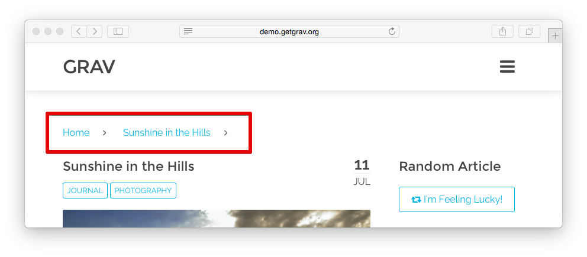

# Grav Breadcrumbs Plugin



`Breadcrumbs` is a [Grav](http://github.com/getgrav/grav) plugin that adds links to the previous pages (following the hierarchical structure).
It is particularly useful if you are using Grav to run a blog.

# Installation

Installing the Breadcrumbs plugin can be done in one of two ways. Our GPM (Grav Package Manager) installation method enables you to quickly and easily install the plugin with a simple terminal command, while the manual method enables you to do so via a zip file. 

## GPM Installation (Preferred)

The simplest way to install this plugin is via the [Grav Package Manager (GPM)](http://learn.getgrav.org/advanced/grav-gpm) through your system's Terminal (also called the command line).  From the root of your Grav install type:

    bin/gpm install breadcrumbs

This will install the Breadcrumbs plugin into your `/user/plugins` directory within Grav. Its files can be found under `/your/site/grav/user/plugins/breadcrumbs`.

## Manual Installation

To install this plugin, just download the zip version of this repository and unzip it under `/your/site/grav/user/plugins`. Then, rename the folder to `breadcrumbs`. You can find these files either on [GitHub](https://github.com/getgrav/grav-plugin-breadcrumbs) or via [GetGrav.org](http://getgrav.org/downloads/plugins#extras).

You should now have all the plugin files under

    /your/site/grav/user/plugins/breadcrumbs

>> NOTE: This plugin is a modular component for Grav which requires [Grav](http://github.com/getgrav/grav), the [Error](https://github.com/getgrav/grav-plugin-error) and [Problems](https://github.com/getgrav/grav-plugin-problems) plugins, and a theme to be installed in order to operate.

# Usage

The `breadcrumbs` plugin doesn't require any configuration. The moment you install it, it is ready to use.

Something you might want to do is to override the look and feel of the breadcrumbs, and with Grav it is super easy.

Copy the template file [breadcrumbs.html.twig](templates/partials/breadcrumbs.html.twig) into the `templates` folder of your custom theme, and that is it. 

```
/your/site/grav/user/themes/custom-theme/templates/partials/breadcrumbs.html.twig
```

You can now edit the override and tweak it however you prefer.

## Per-page Settings

The following options are available for use in a page's YAML frontmatter, placed within the `breadcrumbs` mapping:

| Option      | Default | Values            | Description                                                                          |
|-------------|---------|-------------------|--------------------------------------------------------------------------------------|
| `max_depth` | `true`  | `true` or `false` | Determines whether breadcrumbs for pages beneath the current page will be generated. |

### Example Per-page Settings

```yaml
---
title: Some page you wrote
breadcrumbs:
  may_descend: false # Breadcrumbs will not be generated for pages underneath this one.
---
```

# Updating

As development for the Breadcrumbs plugin continues, new versions may become available that add additional features and functionality, improve compatibility with newer Grav releases, and generally provide a better user experience. Updating Breadcrumbs is easy, and can be done through Grav's GPM system, as well as manually.

## GPM Update (Preferred)

The simplest way to update this plugin is via the [Grav Package Manager (GPM)](http://learn.getgrav.org/advanced/grav-gpm). You can do this with this by navigating to the root directory of your Grav install using your system's Terminal (also called command line) and typing the following:

    bin/gpm update breadcrumbs

This command will check your Grav install to see if your Breadcrumbs plugin is due for an update. If a newer release is found, you will be asked whether or not you wish to update. To continue, type `y` and hit enter. The plugin will automatically update and clear Grav's cache.

## Manual Update

Manually updating Breadcrumbs is pretty simple. Here is what you will need to do to get this done:

* Delete the `your/site/user/plugins/breadcrumbs` directory.
* Download the new version of the Breadcrumbs plugin from either [GitHub](https://github.com/getgrav/grav-plugin-breadcrumbs) or [GetGrav.org](http://getgrav.org/downloads/plugins#extras).
* Unzip the zip file in `your/site/user/plugins` and rename the resulting folder to `breadcrumbs`.
* Clear the Grav cache. The simplest way to do this is by going to the root Grav directory in terminal and typing `bin/grav clear-cache`.

> Note: Any changes you have made to any of the files listed under this directory will also be removed and replaced by the new set. Any files located elsewhere (for example a YAML settings file placed in `user/config/plugins`) will remain intact.

## Configuration

Simply copy the `user/plugins/breadcrumbs/breadcrumbs.yaml` into `user/config/plugins/breadcrumbs.yaml` and make your modifications.

```
enabled: true
show_all: true
built_in_css: true
include_home: true
include_current: true
icon_home: ''
icon_divider_classes: 'fa fa-angle-right'
link_trailing: false
```

Options are pretty self explanatory.

